Gera Relatorio
========================================================
Ainda em fase preliminar


```
## Error: invalid 'description' argument
```

```
## Error: invalid 'description' argument
```

Alerta MRJ
----------

```
## [1] "../c(740, 1112, 1432, 1521, 1393, 1509, 2520, 3912, 4299, 5172, 4405, 3679, 3978, 3200, 2831, 2263, 1644, 1460, 919, 687, 430, 357, 254, 213, 162, 144, 111, 120, 124, 92, 82, 108, 98, 162, 175, 173, 194, 179, 232, 218, 304, 252, 401, 418, 502, 581, 512, 535, 861, 978, 1280, 1459, 1685, 2025, 2480, 2963, 4235, 4967, 4859, 5808, 6129, 6243, 7525, 8644, 8301, 6974, 6396, 5683, 5010, 4038, 3041, 2448, 1709, 1226, 924, 604, 450, 333, 469, 403, 424, 341, 231, 167, 194, 181, 144, 155, 138, 170, 169, 155, 159, \n129, 146, 191, 185, 198, 169, 167, 412, 706, 727, 910, 1087, 1030, 1353, 2501, 2979, 3073, 4107, 4090, 3895, 5116, 5115, 4240, 2989, 2847, 1935, 1274, 963, 571, 468, 383, 294, 235, 186, 137, 124, 62, 79, 58, 43, 53, 35, 46, 54, 39, 63, 46, 44, 47, 58, 54, 38, 42, 65, 88, 92, 18, 9, 6, 10, 6, 11, 13, 9, 30, 41, 35, 34, 21, 19, 29, 21, 12, 20, 16, 16)"                                                                                                                                                                                                                                                                                                                                                                                                                                                                                                                                                                                                                                                                                                                                                                                                                                                                                                                                                                                                                                                                                                                                                                                                                                                                                                                                                                                                                                                                                                                                                                                                                                                                                                                                                                                                                                                                                                                                                                               
## [2] "../c(108, 203, 218, 248, 251, 196, 324, 695, 800, 789, 808, 639, 621, 526, 671, 450, 289, 244, 159, 152, 130, 174, 109, 89, 95, 76, 56, 57, 75, 43, 91, 58, 59, 42, 54, 68, 61, 88, 101, 81, 82, 85, 71, 97, 78, 98, 107, 61, 140, 102, 125, 77, 86, 87, 120, 102, 222, 242, 206, 252, 267, 262, 300, 442, 556, 429, 561, 437, 323, 377, 271, 215, 162, 169, 148, 147, 94, 66, 90, 84, 63, 56, 63, 53, 84, 69, 49, 52, 48, 63, 87, 60, 53, 70, 64, 74, 86, 86, 71, 72, 96, 135, 212, 195, 185, 184, 224, 440, 473, 474, \n659, 869, 852, 932, 1369, 783, 601, 443, 368, 304, 206, 193, 164, 146, 150, 123, 88, 90, 84, 57, 148, 155, 71, 97, 63, 55, 46, 115, 45, 56, 53, 57, 69, 66, 54, 63, 86, 74, 60, 76, 91, 65, 77, 68, 77, 75, 66, 92, 63, 65, 76, 62, 64, 105, 159, 105, 41, 80, 54)"                                                                                                                                                                                                                                                                                                                                                                                                                                                                                                                                                                                                                                                                                                                                                                                                                                                                                                                                                                                                                                                                                                                                                                                                                                                                                                                                                                                                                                                                                                                                                                                                                                                                                                                                                                                                                                                                                                                                                                                                                                                                                
## [3] "../c(24.8571428571429, 24.7142857142857, 24.2857142857143, 24.4285714285714, 23, 22.7142857142857, 23.1428571428571, 22.7142857142857, 23.4285714285714, 22.1428571428571, 23.1428571428571, 22.4285714285714, 20.7142857142857, 20.7142857142857, 20.1428571428571, 17.7142857142857, 17, 18, 15.7142857142857, 16, 17.5714285714286, 17, 15.5714285714286, 15.5714285714286, 18.8571428571429, 16.5714285714286, 17.8571428571429, 18.4285714285714, 19.1428571428571, 18.4285714285714, 17.8571428571429, 17, 18.7142857142857, \n18, 18.2857142857143, 20.2857142857143, 21.8571428571429, 18, 20.7142857142857, 17.7142857142857, 20.1428571428571, 20.7142857142857, 20.7142857142857, 21.2857142857143, 22.4285714285714, 22.4285714285714, 23, 22.1428571428571, 21.8571428571429, 22.8571428571429, 23.5714285714286, 22.7142857142857, 21.4285714285714, 23.8571428571429, 23, 23.5714285714286, 24.1428571428571, 22.7142857142857, 23.2857142857143, 22.8571428571429, 22.7142857142857, 22.8571428571429, 22.8571428571429, 21.4285714285714, \n21.4285714285714, 19.4285714285714, 19.5714285714286, 17.8571428571429, 17.8571428571429, 20.8571428571429, 20.8571428571429, 19.1428571428571, 20.5714285714286, 17.7142857142857, 17.7142857142857, 17.1428571428571, 17.2857142857143, 18, 18.8571428571429, 16.5714285714286, 17.2857142857143, 17.1428571428571, 17.5714285714286, 17.7142857142857, 20.7142857142857, 21, 16.8571428571429, 18.7142857142857, 20.7142857142857, 19.7142857142857, 22.8571428571429, 23.2857142857143, 22.7142857142857, 20.7142857142857, \n21, 21.7142857142857, 24.4285714285714, 24.2857142857143, 25.1428571428571, 25.7142857142857, 24.2857142857143, 22.8571428571429, 22.2857142857143, 22.7142857142857, 23, 23, 25.7142857142857, 25.1428571428571, 22.8571428571429, 24.4285714285714, 24.4285714285714, 22.8571428571429, 22.7142857142857, 22.7142857142857, 23.1428571428571, 20.2857142857143, 19.1428571428571, 20.2857142857143, 17.8571428571429, 19.4285714285714, 19.7142857142857, 19.1428571428571, 18.8571428571429, 19.4285714285714, 19.6, \n19.4285714285714, 17.7142857142857, 15.4285714285714, 19.4285714285714, 17.4285714285714, 15.1428571428571, 18.4285714285714, 17.4285714285714, 18.1428571428571, 17, 18.1428571428571, 18.4285714285714, 21.1428571428571, 19.2857142857143, 20.5714285714286, 17.1428571428571, 20.4285714285714, 22.7142857142857, 19.8571428571429, 19.5714285714286, 22, 21.1428571428571, 22.4285714285714, 23.2857142857143, 24.4285714285714, 24.7142857142857, 25, 24.5714285714286, 22.4285714285714, 24.4285714285714, 23.4285714285714, \n23.8571428571429, 23.7142857142857, 21.8571428571429, 22.7142857142857, 21.5714285714286, 22.1428571428571, 21.5714285714286, 17.2857142857143, 20.1428571428571, 17, 20, 18.4285714285714, 18.7142857142857)"
## [4] "../c(1, 1, 1, 1, 1, 1, 1, 1, 1, 1, 1, 1, 0, 0, 0, 0, 0, 0, 0, 0, 0, 0, 0, 0, 0, 0, 0, 0, 0, 0, 0, 0, 0, 0, 0, 1, 1, 0, 1, 0, 0, 0, 0, 1, 1, 1, 1, 0, 1, 1, 1, 1, 0, 1, 1, 1, 1, 1, 1, 1, 1, 1, 1, 1, 1, 0, 0, 0, 0, 0, 0, 0, 0, 0, 0, 0, 0, 0, 0, 0, 0, 0, 0, 0, 1, 1, 0, 0, 0, 0, 1, 1, 0, 1, 1, 1, 1, 1, 1, 1, 1, 1, 1, 1, 1, 1, 1, 1, 1, 1, 1, 1, 1, 1, 1, 0, 0, 0, 0, 0, 0, 0, 0, 0, 0, 0, 0, 0, 0, 0, 0, 0, 0, 0, 0, 0, 0, 1, 0, 0, 0, 0, 1, 0, 0, 1, 1, 1, 0, 1, 1, 1, 1, 1, 1, 1, 1, 1, 1, 0, 1, 1, 0, 0, 1, 0, 0, \n0, 0)"                                                                                                                                                                                                                                                                                                                                                                                                                                                                                                                                                                                                                                                                                                                                                                                                                                                                                                                                                                                                                                                                                                                                                                                                                                                                                                                                                                                                                                                                                                                                                                                                                                                                                                                                                                                                                                                                                                                                                                                                                                                                                                                                                                                                                                                                                                                                           
## [5] "../c(1, 1, 1, 1, 0, 0, 0, 0, 0, 0, 0, 0, 0, 0, 0, 0, 0, 0, 0, 0, 0, 0, 0, 0, 0, 0, 0, 0, 0, 0, 0, 0, 0, 0, 0, 0, 0, 0, 0, 0, 0, 0, 0, 0, 0, 0, 0, 0, 0, 0, 0, 0, 0, 0, 0, 0, 1, 0, 0, 0, 0, 0, 0, 0, 0, 0, 0, 0, 0, 0, 0, 0, 0, 0, 0, 0, 0, 0, 0, 0, 0, 0, 0, 0, 0, 0, 0, 0, 0, 0, 0, 0, 0, 0, 0, 0, 1, 1, 1, 1, 1, 0, 0, 0, 0, 0, 1, 1, 0, 1, 1, 0, 0, 0, 0, 0, 0, 0, 0, 0, 0, 0, 0, 0, 0, 0, 0, 0, 0, 0, 0, 0, 0, 0, 0, 0, 0, 0, 0, 0, 0, 0, 0, 0, 0, 0, 0, 0, 0, 1, 1, 1, 1, 0, 1, 0, 0, 0, 0, 0, 0, 0, 0, 0, 0, 0, 0, \n0, 0)"                                                                                                                                                                                                                                                                                                                                                                                                                                                                                                                                                                                                                                                                                                                                                                                                                                                                                                                                                                                                                                                                                                                                                                                                                                                                                                                                                                                                                                                                                                                                                                                                                                                                                                                                                                                                                                                                                                                                                                                                                                                                                                                                                                                                                                                                                                                                           
## [6] "../c(0, 0, 0, 0, 0, 0, 0, 0, 1, 1, 1, 1, 0, 0, 0, 0, 0, 0, 0, 0, 0, 0, 0, 0, 0, 0, 0, 0, 0, 0, 0, 0, 0, 0, 0, 0, 0, 0, 0, 0, 0, 0, 0, 0, 0, 0, 0, 0, 0, 0, 0, 0, 0, 0, 0, 0, 0, 1, 1, 1, 1, 1, 1, 1, 1, 1, 1, 1, 1, 1, 0, 0, 0, 0, 0, 0, 0, 0, 0, 0, 0, 0, 0, 0, 0, 0, 0, 0, 0, 0, 0, 0, 0, 0, 0, 0, 0, 0, 0, 0, 0, 0, 0, 0, 0, 0, 0, 0, 0, 0, 0, 1, 1, 0, 1, 1, 0, 0, 0, 0, 0, 0, 0, 0, 0, 0, 0, 0, 0, 0, 0, 0, 0, 0, 0, 0, 0, 0, 0, 0, 0, 0, 0, 0, 0, 0, 0, 0, 0, 0, 0, 0, 0, 0, 0, 0, 0, 0, 0, 0, 0, 0, 0, 0, 0, 0, 0, \n0, 0)"
```

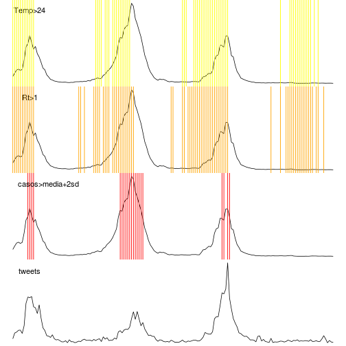 

APS
-----------


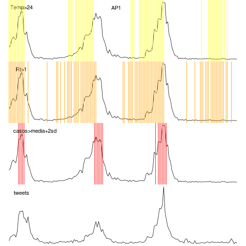 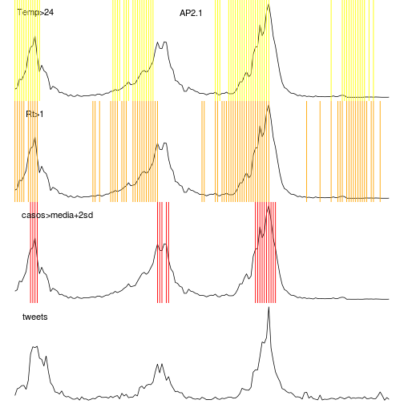 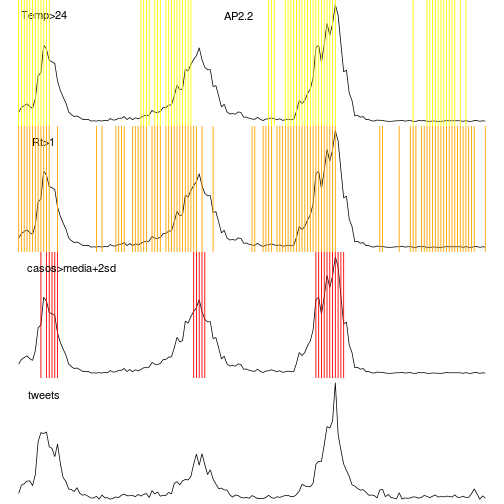 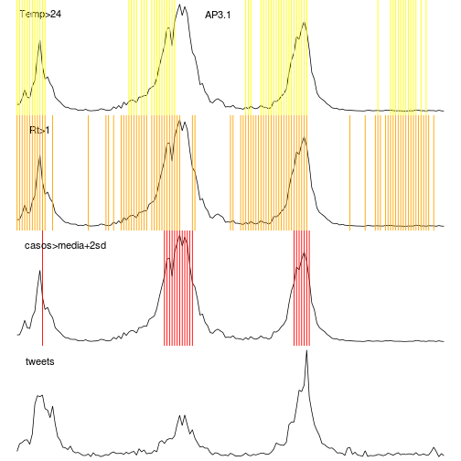 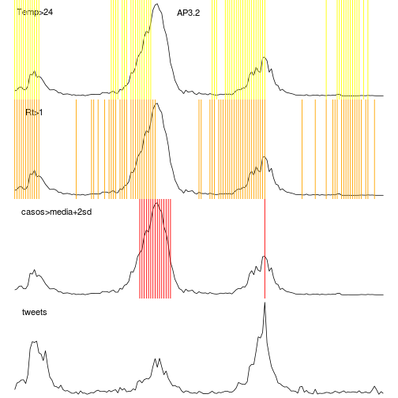 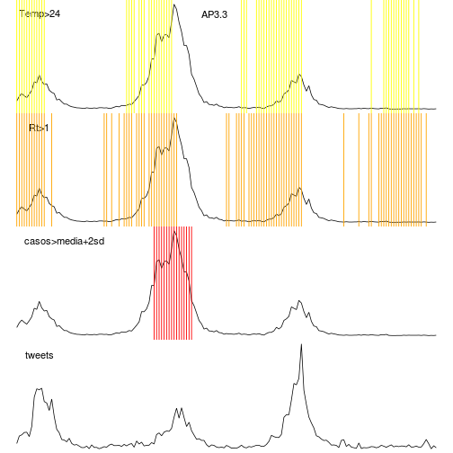 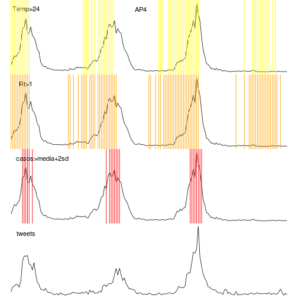 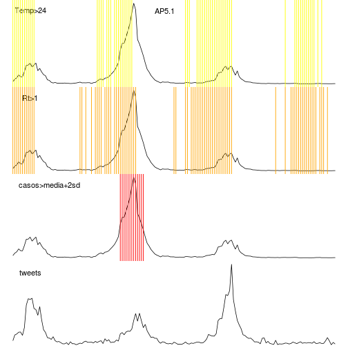 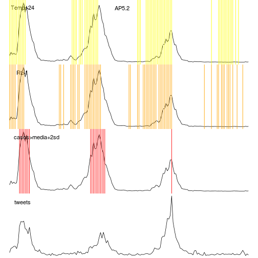 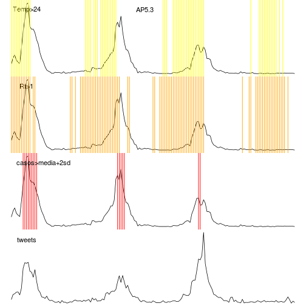 

