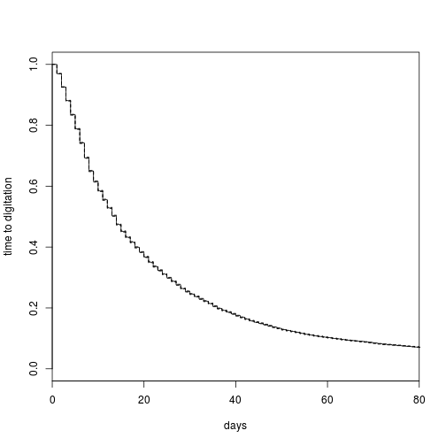
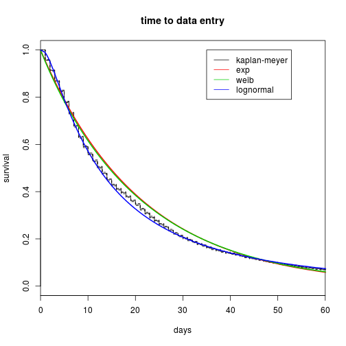
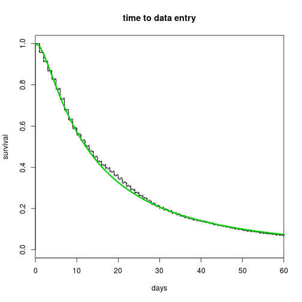

Correção do atraso de notificação
========================================================
author: Claudia Codeço
date: jan 2015

Problema - tempo até digitar caso
========================================================

 

Tempo até digitar caso
==================

```
   Min. 1st Qu.  Median    Mean 3rd Qu.    Max. 
   0.00    6.00   13.00   25.13   30.00  614.00 
```

 

Anos 2013 e 2014 parecidos
==============================

 

 fit com dados de 2013 em diante
=============================


```r
dss<-subset(ds,(ano=="2013"|ano=="2014"))
y <- Surv(time=dss$tempo,event=dss$status==TRUE)
km <- survfit(y~1)

mexp<-survreg(y~1,dist="exp")
mweib<-survreg(y~1,dist="weib")
mgaus<-survreg(y~1,dist="gaussian")
mlogi<-survreg(y~1,dist="logistic")
mlognorm<-survreg(y~1,dist="lognormal",x=TRUE,y=TRUE,model=TRUE)
mloglog<-survreg(y~1,dist="loglogistic")
```

======================================

```r
AIC(mexp,mweib,mgaus,mlogi,mlognorm,mloglog)
```

```
         df      AIC
mexp      1 441617.2
mweib     2 441573.0
mgaus     2 503670.6
mlogi     2 486585.3
mlognorm  2 437804.5
mloglog   2 439298.0
```

======================================
 

Modelo lognormal
===========================

```r
summary(mlognorm)
```

```

Call:
survreg(formula = y ~ 1, dist = "lognormal", model = TRUE, x = TRUE, 
    y = TRUE)
             Value Std. Error     z         p
(Intercept) 2.5016    0.00472 530.2  0.00e+00
Log(scale)  0.0965    0.00303  31.9 7.66e-223

Scale= 1.1 

Log Normal distribution
Loglik(model)= -218900.2   Loglik(intercept only)= -218900.2
Number of Newton-Raphson Iterations: 5 
n= 54492 
```

```r
# parametros: meanlog = intercept; sdlog=exp(scale)
```

=============================
 

Série temporal sem correção
========================================================
 

Série temporal com correção
===========================

 

