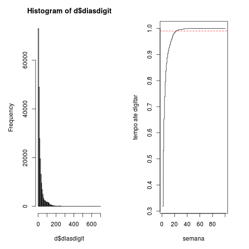
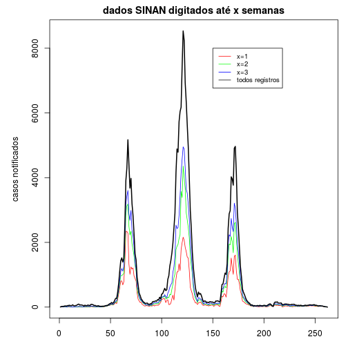
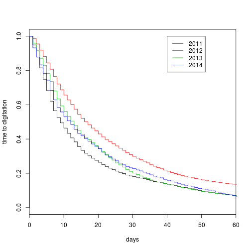
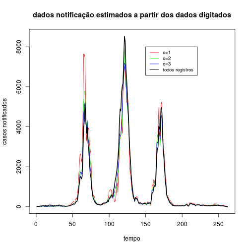

Correção do atraso de notificação
========================================================
author: Claudia Codeço
date: jan 2015

Problema - tempo até digitar caso
========================================================

 


Tempo até digitar caso
==================

```
   Min. 1st Qu.  Median    Mean 3rd Qu.    Max. 
   0.00    6.00   13.00   25.13   30.00  614.00 
```


Série temporal sem correção
========================================================
 


Curva de sobrevivência (Kaplan-Meyer)
==============================

 

 fit com dados de 2013 em diante
=============================


======================================

```r
AIC(mexp,mweib,mgaus,mlogi,mlognorm,mloglog)
```

```
         df      AIC
mexp      1 441617.2
mweib     2 441573.0
mgaus     2 503670.6
mlogi     2 486585.3
mlognorm  2 437804.5
mloglog   2 439298.0
```

======================================


 

Modelo lognormal
===========================

```

Call:
survreg(formula = y ~ 1, dist = "lognormal", model = TRUE, x = TRUE, 
    y = TRUE)
             Value Std. Error     z         p
(Intercept) 2.5016    0.00472 530.2  0.00e+00
Log(scale)  0.0965    0.00303  31.9 7.66e-223

Scale= 1.1 

Log Normal distribution
Loglik(model)= -218900.2   Loglik(intercept only)= -218900.2
Number of Newton-Raphson Iterations: 5 
n= 54492 
```

```
               2.5 %   97.5 %
(Intercept) 2.492393 2.510887
```

Modelo lognormal
=============================

```
(Intercept) 
    2.50164 
```

```
Log(scale) 
  1.101342 
```

 


Série temporal com correção
===========================


```
[1] 0.3069223
```

```
[1] 0.5496483
```

```
[1] 0.6889684
```

 

