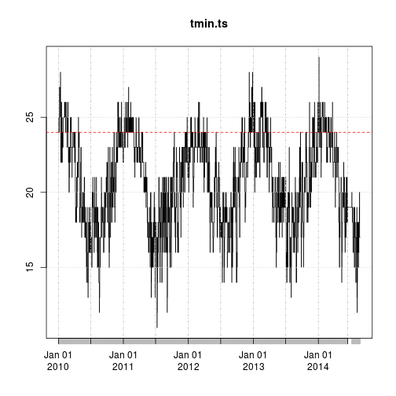
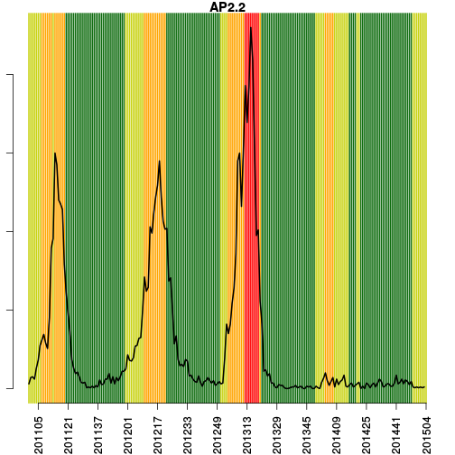
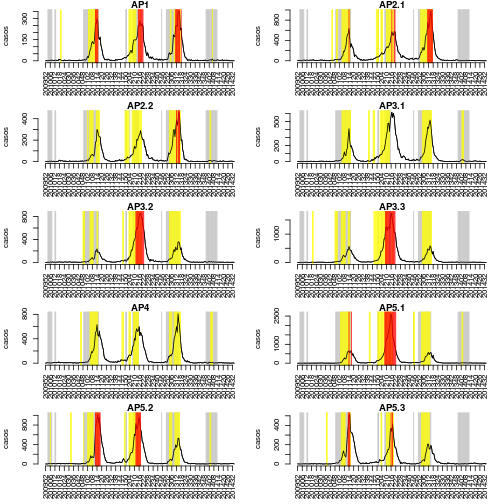

Alerta de Dengue para o Rio de Janeiro
======================
versao 0.2


**Hoje e' dia 2014-10-01 , SE 201440**


**Curvas epidemica da dengue na cidade**


Os ultimos dados disponiveis de casos de dengue se referem a'semana 201434:


```
##         SE  x
## 239 201430 25
## 240 201431 38
## 241 201432 31
## 242 201433 30
## 243 201434  5
## 244 201435 NA
```

 

**Curvas epidemicas da dengue por APS**

 


**Tweet na cidade**


Os ultimos dados disponiveis de tweet sao da semana 201435:


```
##          SE tweets
## 2435 201430     55
## 2436 201431     54
## 2437 201432     68
## 2438 201433     47
## 2439 201434     50
## 2440 201435     68
```

 

** Dados de temperatura mínima e máxima por APS**


Os ultimos dados disponiveis de temperatura minima sao da semana 201435. 


```
##   AP1 AP2.1 AP2.2 AP3.1 AP3.2 AP3.3   AP4 AP5.1 AP5.2 AP5.3 
##    17    17    17    17    17    17    17    17    17    17
```

 

** Dados de umidade mínima e máxima por APS**
 


Modelo de alerta com 5 indicadores
========

- Cli = Temperatura minima semanal > 22 graus por 3 semanas
- tw1 = crescimento significativo de tweet na ultima semana
- Rt =  (Rt > 1) por 3 semanas. Se nao houver notificacao, completar com o Rt dos tweets
- C = Casos > limiar de epidemia (300 por 100.000) 
- Rm = Mosquitos que aumentam significativamente


**Grafico de Prob(Rt > 1)**

 


**Alerta por APS**

Para cada APS, indica-se as semanas em que houve alerta de temperatura, de Rt e de casos.

```
## [1] "AP1"
##         SE APS Cli ac.Rtgreat1 alertaCasos
## 241 201430 AP1   0           0           0
## 238 201431 AP1   0           0           0
## 235 201432 AP1   0           0           0
## 244 201433 AP1   0           0           0
## 242 201434 AP1   0           0           0
## 127 201435 AP1   0           0           0
```

```
## [1] "AP2.1"
##         SE   APS Cli ac.Rtgreat1 alertaCasos
## 471 201430 AP2.1   0           0           0
## 468 201431 AP2.1   0           0           0
## 478 201432 AP2.1   0           0           0
## 475 201433 AP2.1   0           1           0
## 472 201434 AP2.1   0           1           0
## 452 201435 AP2.1   0           1           0
```

```
## [1] "AP2.2"
##         SE   APS Cli ac.Rtgreat1 alertaCasos
## 646 201430 AP2.2   0           1           0
## 656 201431 AP2.2   0           0           0
## 666 201432 AP2.2   0           0           0
## 676 201433 AP2.2   0           0           0
## 686 201434 AP2.2   0           0           0
## 683 201435 AP2.2   0           0           0
```

```
## [1] "AP3.1"
##         SE   APS Cli ac.Rtgreat1 alertaCasos
## 945 201430 AP3.1   0           0           0
## 955 201431 AP3.1   0           0           0
## 965 201432 AP3.1   0           0           0
## 962 201433 AP3.1   0           0           0
## 972 201434 AP3.1   0           0           0
## 926 201435 AP3.1   0           0           0
```

```
## [1] "AP3.2"
##          SE   APS Cli ac.Rtgreat1 alertaCasos
## 1216 201430 AP3.2   0           0           0
## 1213 201431 AP3.2   0           0           0
## 1214 201432 AP3.2   0           0           0
## 1211 201433 AP3.2   0           0           0
## 1208 201434 AP3.2   0           0           0
## 1184 201435 AP3.2   0           0           0
```

```
## [1] "AP3.3"
##          SE   APS Cli ac.Rtgreat1 alertaCasos
## 1450 201430 AP3.3   0           0           0
## 1460 201431 AP3.3   0           0           0
## 1464 201432 AP3.3   0           0           0
## 1454 201433 AP3.3   0           0           0
## 1451 201434 AP3.3   0           0           0
## 1457 201435 AP3.3   0           0           0
```

```
## [1] "AP4"
##          SE APS Cli ac.Rtgreat1 alertaCasos
## 1677 201430 AP4   0           0           0
## 1687 201431 AP4   0           0           0
## 1684 201432 AP4   0           1           0
## 1694 201433 AP4   0           2           0
## 1704 201434 AP4   0           2           0
## 1701 201435 AP4   0           2           0
```

```
## [1] "AP5.1"
##          SE   APS Cli ac.Rtgreat1 alertaCasos
## 1946 201430 AP5.1   0           0           0
## 1943 201431 AP5.1   0           0           0
## 1940 201432 AP5.1   0           0           0
## 1937 201433 AP5.1   0           0           0
## 1947 201434 AP5.1   0           0           0
## 1944 201435 AP5.1   0           0           0
```

```
## [1] "AP5.2"
##          SE   APS Cli ac.Rtgreat1 alertaCasos
## 2121 201430 AP5.2   0           0           0
## 2131 201431 AP5.2   0           0           0
## 2141 201432 AP5.2   0           0           0
## 2151 201433 AP5.2   0           0           0
## 2161 201434 AP5.2   0           0           0
## 2171 201435 AP5.2   0           0           0
```

```
## [1] "AP5.3"
##          SE   APS Cli ac.Rtgreat1 alertaCasos
## 2390 201430 AP5.3   0           0           0
## 2400 201431 AP5.3   0           1           0
## 2410 201432 AP5.3   0           2           0
## 2420 201433 AP5.3   0           2           0
## 2430 201434 AP5.3   0           2           0
## 2440 201435 AP5.3   0           1           0
```

 


