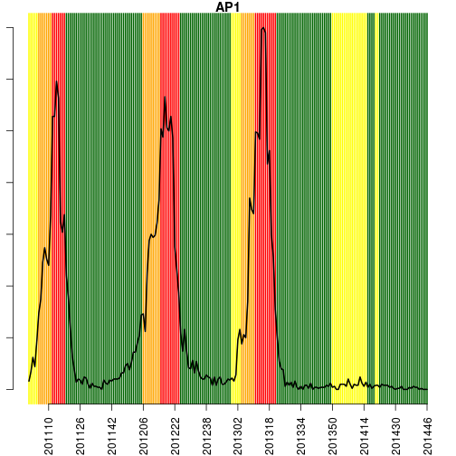
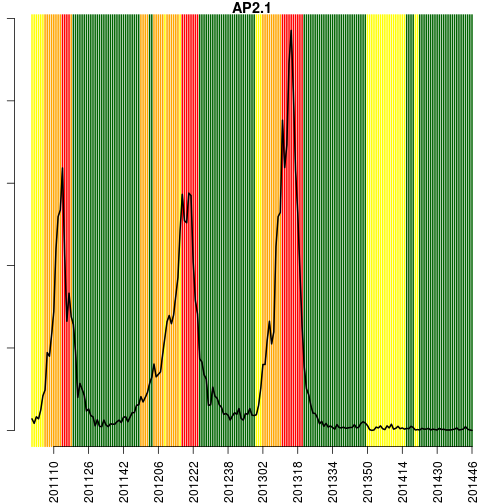
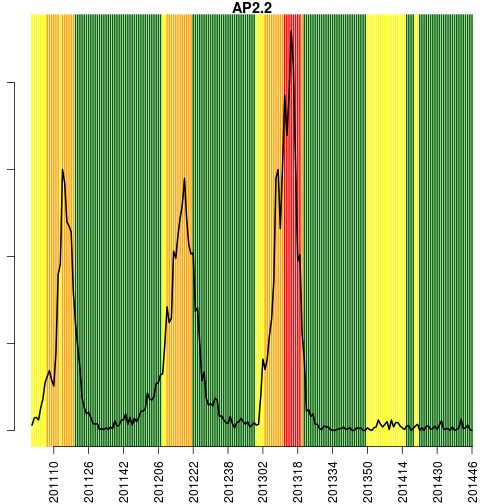
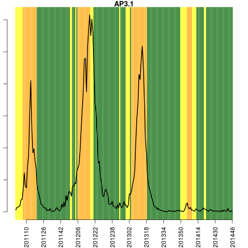
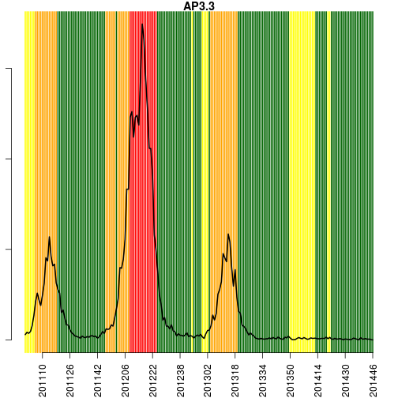
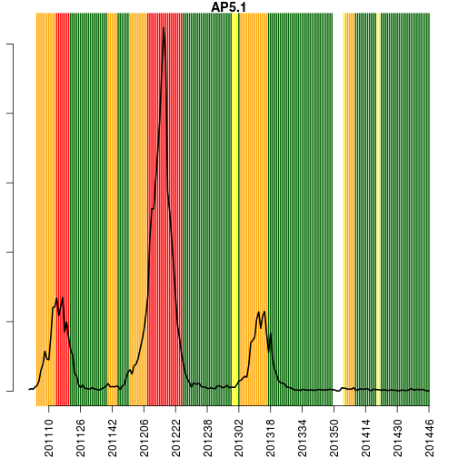
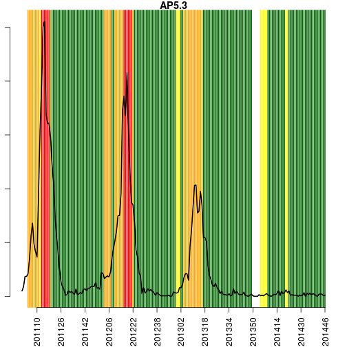

Relatorio Semanal do Projeto Alerta Dengue para a cidade do Rio de Janeiro
===========================================================


**Rio de Janeiro, 2014-11-10  (SE 201446)**


Dengue a nivel da cidade
-----------------------


Dados das ultimas 12 semanas:


```
##         SE casos casos_corrigidos tweets tempmin
## 243 201435    55            58.82     81   17.61
## 244 201436    57            61.62     53   17.99
## 245 201437    44            48.09     45   17.85
## 246 201438    54            59.80     57   19.57
## 247 201439    52            58.56     80   18.95
## 248 201440    55            63.44     65   20.15
## 249 201441    55            65.79     57   17.77
## 250 201442    66            83.02    105   20.44
## 251 201443    52            70.47     88   20.06
## 252 201444    88           134.97     58   21.12
## 253 201445    11            20.72     55   22.37
## 254 201446    NA               NA     NA   21.70
```

Legenda:

- SE: semana epidemiologica
- casos: numero de casos de dengue no SINAN
- casos_corrigidos: estimativa do numero de casos notificados (1)
- tweets: numero de tweets relatando sintomas de dengue (2)
- tempmin: media das temperaturas minimas da semana


 


 

 


Alerta por APS em 4 niveis
-------------

**Verde (atividade baixa)** 
- se temperatura < 22 graus por 3 semanas 
- se atividade de tweet for normal (nao aumentada)
- ausencia de transmissao sustentada
- se incidencia < 100:100.000

**Amarelo (Alerta)**
- se temperatura > 22C por mais de 3 semanas
- se atividade de tweet aumentar

**Laranja (Transmissao sustentada)**
- se numero reprodutivo >1, por 3 semanas

**Vermelho (atividade alta)**
- se incidencia > 100:100.000


Resultado
---------

**Legenda:**
- SE : semana epidemiologica
- data: data de inicio da SE
- APS: area programatica da saude
- tempmin: media das temperaturas minimas da semana
- casos_est: numero de casos estimados na semana (3)
- inc: casos por 100.000 habitantes
- alertaClima = 1, se temperatura > 22C por mais de 3 semanas
- alertaTweet = 1, se Tweet com tendencia de aumento 
- alertaTransmissao = 1, se casos com tendencia de aumento
- alertaCasos = 1, se Incidencia > 100 por 100 mil

 


```
## [1] "AP1"
##         SE       data APS tempmin casos_est    inc alertaClima alertaTweet
## 157 201439 2014-09-24 AP1   20.50         3 1.3218           0           0
## 167 201440 2014-10-01 AP1   20.33         3 1.3218           0           0
## 164 201441 2014-10-08 AP1   19.43         5 2.2030           0           0
## 174 201442 2014-10-15 AP1   20.43         0 0.0000           0           0
## 184 201443 2014-10-22 AP1   20.71         1 0.4406           0           0
## 194 201444 2014-10-29 AP1   22.29         0 0.0000           0           0
## 204 201445 2014-11-05 AP1   22.00         0 0.0000           0           0
## 214 201446 2014-11-09 AP1   22.00         0 0.0000           0          NA
##     alertaTransmissao alertaCasos nivel
## 157                 0           0 verde
## 167                 0           0 verde
## 164                 0           0 verde
## 174                 0           0 verde
## 184                 0           0 verde
## 194                 0           0 verde
## 204                 0           0 verde
## 214                NA           0  nulo
```

 

```
## [1] "AP2.1"
##         SE       data   APS tempmin casos_est    inc alertaClima
## 482 201439 2014-09-24 AP2.1   20.50     6.000 1.0856           0
## 479 201440 2014-10-01 AP2.1   20.33     2.000 0.3619           0
## 489 201441 2014-10-08 AP2.1   19.43     2.000 0.3619           0
## 499 201442 2014-10-15 AP2.1   20.43     4.000 0.7237           0
## 505 201443 2014-10-22 AP2.1   20.71    10.000 1.8093           0
## 506 201444 2014-10-29 AP2.1   22.29     4.000 0.7237           0
## 503 201445 2014-11-05 AP2.1   22.00     1.000 0.1809           0
## 507 201446 2014-11-09 AP2.1   22.00     4.714 0.8529           0
##     alertaTweet alertaTransmissao alertaCasos nivel
## 482           0                 0           0 verde
## 479           0                 0           0 verde
## 489           0                 0           0 verde
## 499           0                 0           0 verde
## 505           0                 0           0 verde
## 506           0                 0           0 verde
## 503           0                 0           0 verde
## 507          NA                NA           0  nulo
```

 

```
## [1] "AP2.2"
##         SE       data   APS tempmin casos_est    inc alertaClima
## 726 201439 2014-09-24 AP2.2   20.50     0.000 0.0000           0
## 723 201440 2014-10-01 AP2.2   20.33     3.000 0.8084           0
## 720 201441 2014-10-08 AP2.2   19.43    14.000 3.7724           0
## 730 201442 2014-10-15 AP2.2   20.43     4.000 1.0778           0
## 727 201443 2014-10-22 AP2.2   20.71     4.000 1.0778           0
## 737 201444 2014-10-29 AP2.2   22.29     6.000 1.6167           0
## 747 201445 2014-11-05 AP2.2   22.00     1.000 0.2695           0
## 744 201446 2014-11-09 AP2.2   22.00     4.336 1.1683           0
##     alertaTweet alertaTransmissao alertaCasos nivel
## 726           0                 0           0 verde
## 723           0                 0           0 verde
## 720           0                 0           0 verde
## 730           0                 0           0 verde
## 727           0                 0           0 verde
## 737           0                 0           0 verde
## 747           0                 0           0 verde
## 744          NA                NA           0  nulo
```

 

```
## [1] "AP3.1"
##          SE       data   APS tempmin casos_est    inc alertaClima
## 969  201439 2014-09-24 AP3.1   18.71     6.000 0.8155           0
## 979  201440 2014-10-01 AP3.1   19.83     6.000 0.8155           0
## 976  201441 2014-10-08 AP3.1   17.14     3.000 0.4077           0
## 973  201442 2014-10-15 AP3.1   20.86    11.000 1.4950           0
## 983  201443 2014-10-22 AP3.1   20.29     3.000 0.4077           0
## 993  201444 2014-10-29 AP3.1   21.29     2.000 0.2718           0
## 1003 201445 2014-11-05 AP3.1   22.86     3.000 0.4077           0
## 1009 201446 2014-11-09 AP3.1   21.00     1.952 0.2652           0
##      alertaTweet alertaTransmissao alertaCasos nivel
## 969            0                 0           0 verde
## 979            0                 0           0 verde
## 976            0                 0           0 verde
## 973            0                 0           0 verde
## 983            0                 0           0 verde
## 993            0                 0           0 verde
## 1003           0                 0           0 verde
## 1009          NA                NA           0  nulo
```

 

```
## [1] "AP3.2"
##          SE       data   APS tempmin casos_est    inc alertaClima
## 1227 201439 2014-09-24 AP3.2   18.71     2.000 0.4084           0
## 1237 201440 2014-10-01 AP3.2   19.83     4.000 0.8168           0
## 1234 201441 2014-10-08 AP3.2   17.14     1.000 0.2042           0
## 1231 201442 2014-10-15 AP3.2   20.86     6.000 1.2252           0
## 1241 201443 2014-10-22 AP3.2   20.29     4.000 0.8168           0
## 1251 201444 2014-10-29 AP3.2   21.29     2.000 0.4084           0
## 1248 201445 2014-11-05 AP3.2   22.86     0.000 0.0000           0
## 1258 201446 2014-11-09 AP3.2   21.00     2.264 0.4624           0
##      alertaTweet alertaTransmissao alertaCasos nivel
## 1227           0                 0           0 verde
## 1237           0                 0           0 verde
## 1234           0                 0           0 verde
## 1231           0                 0           0 verde
## 1241           0                 0           0 verde
## 1251           0                 0           0 verde
## 1248           0                 0           0 verde
## 1258          NA                NA           0  nulo
```

 

```
## [1] "AP3.3"
##          SE       data   APS tempmin casos_est    inc alertaClima
## 1513 201439 2014-09-24 AP3.3   18.71    13.000 1.4064           0
## 1510 201440 2014-10-01 AP3.3   19.83     5.000 0.5409           0
## 1520 201441 2014-10-08 AP3.3   17.14     6.000 0.6491           0
## 1517 201442 2014-10-15 AP3.3   20.86    11.000 1.1900           0
## 1514 201443 2014-10-22 AP3.3   20.29     5.000 0.5409           0
## 1523 201444 2014-10-29 AP3.3   21.29     6.000 0.6491           0
## 1521 201445 2014-11-05 AP3.3   22.86     1.000 0.1082           0
## 1519 201446 2014-11-09 AP3.3   21.00     6.437 0.6964           0
##      alertaTweet alertaTransmissao alertaCasos nivel
## 1513           0                 0           0 verde
## 1510           0                 0           0 verde
## 1520           0                 0           0 verde
## 1517           0                 0           0 verde
## 1514           0                 0           0 verde
## 1523           0                 0           0 verde
## 1521           0                 0           0 verde
## 1519          NA                NA           0  nulo
```

 

```
## [1] "AP4"
##          SE       data APS tempmin casos_est     inc alertaClima
## 1757 201439 2014-09-24 AP4   19.57       6.0  0.7153           0
## 1767 201440 2014-10-01 AP4   22.33       6.0  0.7153           0
## 1764 201441 2014-10-08 AP4   18.71       4.0  0.4768           0
## 1774 201442 2014-10-15 AP4   21.00       7.0  0.8345           0
## 1758 201443 2014-10-22 AP4   20.14       4.0  0.4768           0
## 1768 201444 2014-10-29 AP4   20.50      43.0  5.1260           0
## 1777 201445 2014-11-05 AP4   22.71       3.0  0.3576           0
## 1775 201446 2014-11-09 AP4   22.00     181.4 21.6190           0
##      alertaTweet alertaTransmissao alertaCasos nivel
## 1757           0                 0           0 verde
## 1767           0                 0           0 verde
## 1764           0                 0           0 verde
## 1774           0                 0           0 verde
## 1758           0                 0           0 verde
## 1768           0                 0           0 verde
## 1777           0                 0           0 verde
## 1775          NA                NA           0  nulo
```

 

```
## [1] "AP5.1"
##          SE       data   APS tempmin casos_est    inc alertaClima
## 2013 201439 2014-09-24 AP5.1   17.43     7.000 1.0673           0
## 2023 201440 2014-10-01 AP5.1   19.57    14.000 2.1346           0
## 2020 201441 2014-10-08 AP5.1   16.43    14.000 2.1346           0
## 2017 201442 2014-10-15 AP5.1   19.86    11.000 1.6772           0
## 2014 201443 2014-10-22 AP5.1   19.14    11.000 1.6772           0
## 2024 201444 2014-10-29 AP5.1   20.00     6.000 0.9148           0
## 2032 201445 2014-11-05 AP5.1   22.14     1.000 0.1525           0
## 2027 201446 2014-11-09 AP5.1   22.00     5.005 0.7631           0
##      alertaTweet alertaTransmissao alertaCasos nivel
## 2013           0                 0           0 verde
## 2023           0                 0           0 verde
## 2020           0                 0           0 verde
## 2017           0                 0           0 verde
## 2014           0                 0           0 verde
## 2024           0                 0           0 verde
## 2032           0                 0           0 verde
## 2027          NA                NA           0  nulo
```

 

```
## [1] "AP5.2"
##          SE       data   APS tempmin casos_est    inc alertaClima
## 2214 201439 2014-09-24 AP5.2   17.43      5.00 0.7517           0
## 2224 201440 2014-10-01 AP5.2   19.57     10.00 1.5033           0
## 2221 201441 2014-10-08 AP5.2   16.43      5.00 0.7517           0
## 2231 201442 2014-10-15 AP5.2   19.86      6.00 0.9020           0
## 2241 201443 2014-10-22 AP5.2   19.14      6.00 0.9020           0
## 2251 201444 2014-10-29 AP5.2   20.00     13.00 1.9543           0
## 2261 201445 2014-11-05 AP5.2   22.14      1.00 0.1503           0
## 2271 201446 2014-11-09 AP5.2   22.00     21.38 3.2137           0
##      alertaTweet alertaTransmissao alertaCasos nivel
## 2214           0                 0           0 verde
## 2224           0                 0           0 verde
## 2221           0                 0           0 verde
## 2231           0                 0           0 verde
## 2241           0                 0           0 verde
## 2251           0                 0           0 verde
## 2261           0                 0           0 verde
## 2271          NA                NA           0  nulo
```

 

```
## [1] "AP5.3"
##          SE       data   APS tempmin casos_est    inc alertaClima
## 2470 201439 2014-09-24 AP5.3   17.43     4.000 1.0854           0
## 2480 201440 2014-10-01 AP5.3   19.57     2.000 0.5427           0
## 2490 201441 2014-10-08 AP5.3   16.43     1.000 0.2713           0
## 2500 201442 2014-10-15 AP5.3   19.86     6.000 1.6281           0
## 2510 201443 2014-10-22 AP5.3   19.14     4.000 1.0854           0
## 2520 201444 2014-10-29 AP5.3   20.00     6.000 1.6281           0
## 2530 201445 2014-11-05 AP5.3   22.14     0.000 0.0000           0
## 2540 201446 2014-11-09 AP5.3   22.00     9.392 2.5483           0
##      alertaTweet alertaTransmissao alertaCasos nivel
## 2470           0                 0           0 verde
## 2480           0                 0           0 verde
## 2490           0                 0           0 verde
## 2500           0                 0           0 verde
## 2510           0                 0           0 verde
## 2520           0                 0           0 verde
## 2530           0                 0           0 verde
## 2540          NA                NA           0  nulo
```

 


**Confira o mapa da dengue em alerta.dengue.mat.br**

Notas
-----
- (1) Os dados do sinan mais recentes ainda nao foram totalmente digitados. Estimamos o numero esperado de casos
notificados considerando o tempo ate os casos serem digitados.
- (2) Os dados de tweets sao gerados pelo Observatorio de Dengue (UFMG). Os tweets sao processados para exclusao de informes e outros temas relacionados a dengue
- (3) Algumas vezes, os casos da ultima semana ainda nao estao disponiveis, nesse caso, usa-se uma estimacao com base na tendencia de variacao da serie 

Creditos
------
Esse e um projeto desenvolvido em parceria pela Fiocruz, FGV e Prefeitura do Rio de Janeiro, com apoio da SVS/MS

Mais detalhes, ver: www.dengue.mat.br
