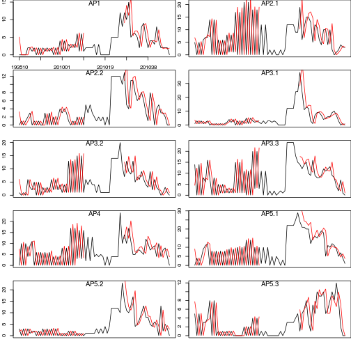
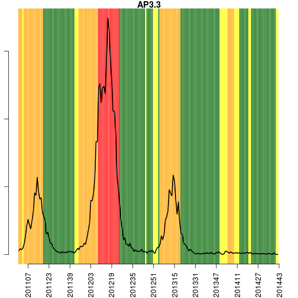
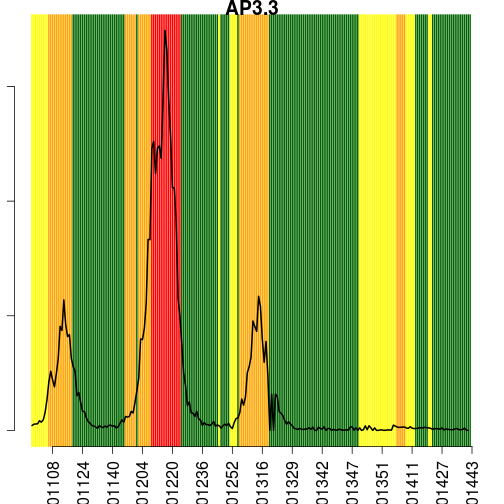

Alerta de Dengue para o Rio de Janeiro
======================
versao 0.2


**Hoje e' dia 2014-10-24 , SE 201443**


**Curvas epidemica da dengue na cidade**


Os ultimos dados disponiveis de casos de dengue se referem a'semana 201441:


 


**Tweet na cidade**


Os ultimos dados disponiveis de tweet sao da semana 201442:


```
##          SE tweets
## 2865 201438     62
## 2866 201439     80
## 2867 201440     65
## 2868 201441    143
## 2869 201442    105
## 2870 201443     NA
```

 

**Dados de temperatura minima por APS**


Os ultimos dados disponiveis de temperatura minima sao da semana 201443. 


```
##   AP1 AP2.1 AP2.2 AP3.1 AP3.2 AP3.3   AP4 AP5.1 AP5.2 AP5.3 
##    22    22    22    22    22    22    21    20    20    20
```


 


Alerta por APS
==============

Para cada APS, indica-se as semanas em que houve alerta de temperatura, de Rt e de casos.

```
##        APS     SE       data tweets estacao casos casosm temp.min Pop2010
## 2820 AP5.3 201438 2014-09-17     62 afonsos     3  3.589    18.57  368534
## 2830 AP5.3 201439 2014-09-24     80 afonsos     1  1.258    17.43  368534
## 2840 AP5.3 201440 2014-10-01     65 afonsos     1  1.355    19.57  368534
## 2850 AP5.3 201441 2014-10-08    143 afonsos     0  0.000    16.43  368534
## 2860 AP5.3 201442 2014-10-15    105 afonsos    NA     NA    19.86  368534
## 2870 AP5.3 201443 2014-10-19     NA afonsos    NA     NA    20.00  368534
##      alertaCli    Rtw   ptw1  Rtwlr Rtwur twgreat1 alertaRtweet     Rt
## 2820         0 0.8939 0.1507 0.7195 1.100        0            1 0.8848
## 2830         0 1.1687 0.9267 0.9408 1.431        1            1 0.6324
## 2840         0 1.1070 0.8435 0.9040 1.340        1            2 0.6555
## 2850         0 1.3913 0.9999 1.1575 1.652        1            3 0.4214
## 2860         0 1.0868 0.8463 0.9231 1.270        1            4     NA
## 2870         0     NA     NA     NA    NA       NA           NA     NA
##         pRt1   Rtlr  Rtur    pRti Rtgreat1 alertaRt casos_est    inc
## 2820 0.36322 0.4374 1.630 0.36322        0        1    3.0000 0.8140
## 2830 0.12772 0.2900 1.318 0.12772        0        1    1.0000 0.2713
## 2840 0.19786 0.2544 1.564 0.19786        0        0    1.0000 0.2713
## 2850 0.09839 0.1380 1.451 0.09839        0        0    0.0000 0.0000
## 2860      NA     NA    NA 0.84628        1        1    0.5384 0.1461
## 2870      NA     NA    NA      NA       NA       NA    0.0000 0.0000
##      alertaCasos cor
## 2820           0   1
## 2830           0   1
## 2840           0   1
## 2850           0   2
## 2860           0   2
## 2870           0  NA
```

   

```
## RStudioGD 
##         2
```


