Relatorio Semanal do Projeto Alerta Dengue para a cidade do Rio de Janeiro
===========================================================


**Rio de Janeiro, 2014-11-25  (SE 201448)**


Dengue a nivel da cidade
-----------------------


Dados das ultimas 12 semanas:


```
##         SE casos casos_corrigidos tweets  tempmin
## 244 201436    57         60.96257     53 17.98571
## 245 201437    44         47.56757     45 17.85429
## 246 201438    54         59.01639     57 19.57048
## 247 201439    53         58.69324     80 18.95000
## 248 201440    57         64.18919     65 20.15476
## 249 201441    57         65.75153    134 17.77143
## 250 201442    68         81.33971    105 20.44286
## 251 201443    56         70.44025     88 20.05714
## 252 201444    95        128.74373     58 21.12143
## 253 201445    29         44.47853     55 22.37143
## 254 201446    19         35.78154     47 21.70000
## 255 201447    10         31.54574     50 18.91000
```

Legenda:

- SE: semana epidemiologica
- casos: numero de casos de dengue no SINAN
- casos_corrigidos: estimativa do numero de casos notificados (1)
- tweets: numero de tweets relatando sintomas de dengue (2)
- tempmin: media das temperaturas minimas da semana


 


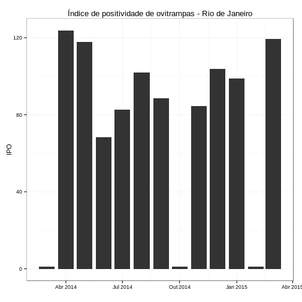 

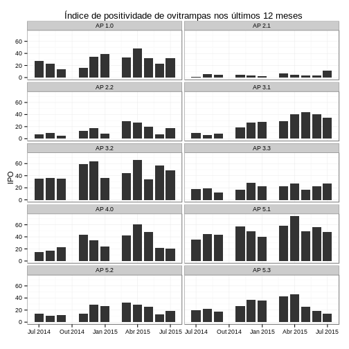 


Alerta por APS em 4 niveis
-------------

**Verde (atividade baixa)** 
- se temperatura < 22 graus por 3 semanas 
- se atividade de tweet for normal (nao aumentada)
- ausencia de transmissao sustentada
- se incidencia < 100:100.000

**Amarelo (Alerta)**
- se temperatura > 22C por mais de 3 semanas
- se atividade de tweet aumentar

**Laranja (Transmissao sustentada)**
- se numero reprodutivo >1, por 3 semanas

**Vermelho (atividade alta)**
- se incidencia > 100:100.000


Resultado
---------

**Legenda:**
- SE : semana epidemiologica
- data: data de inicio da SE
- APS: area programatica da saude
- tempmin: media das temperaturas minimas da semana
- casos_est: numero de casos estimados na semana (3)
- inc: casos por 100.000 habitantes
- alertaClima = 1, se temperatura > 22C por mais de 3 semanas
- alertaTweet = 1, se Tweet com tendencia de aumento 
- alertaTransmissao = 1, se casos com tendencia de aumento
- alertaCasos = 1, se Incidencia > 100 por 100 mil

 


```
## [1] "AP1"
##         SE       data APS  tempmin casos_est       inc alertaClima
## 167 201440 2014-10-01 AP1 20.33333         4 1.7624018           0
## 164 201441 2014-10-08 AP1 19.42857         4 1.7624018           0
## 174 201442 2014-10-15 AP1 20.42857         0 0.0000000           0
## 184 201443 2014-10-22 AP1 20.71429         1 0.4406005           0
## 194 201444 2014-10-29 AP1 22.28571         0 0.0000000           0
## 204 201445 2014-11-05 AP1 22.00000         0 0.0000000           0
## 214 201446 2014-11-12 AP1 22.00000         2 0.8812009           0
## 224 201447 2014-11-19 AP1 20.16000         1 0.4406005           0
##     alertaTweet alertaTransmissao alertaCasos nivel
## 167           0                 0           0 verde
## 164           0                 0           0 verde
## 174           0                 0           0 verde
## 184           0                 0           0 verde
## 194           0                 0           0 verde
## 204           0                 0           0 verde
## 214           0                 0           0 verde
## 224           0                 0           0 verde
```

 

```
## [1] "AP2.1"
##         SE       data   APS  tempmin casos_est       inc alertaClima
## 492 201440 2014-10-01 AP2.1 20.33333         2 0.3618659           0
## 489 201441 2014-10-08 AP2.1 19.42857         2 0.3618659           0
## 499 201442 2014-10-15 AP2.1 20.42857         4 0.7237317           0
## 507 201443 2014-10-22 AP2.1 20.71429        11 1.9902622           0
## 506 201444 2014-10-29 AP2.1 22.28571         4 0.7237317           0
## 503 201445 2014-11-05 AP2.1 22.00000         1 0.1809329           0
## 509 201446 2014-11-12 AP2.1 22.00000         0 0.0000000           0
## 508 201447 2014-11-19 AP2.1 20.16000         1 0.1809329           0
##     alertaTweet alertaTransmissao alertaCasos nivel
## 492           0                 0           0 verde
## 489           0                 0           0 verde
## 499           0                 0           0 verde
## 507           0                 0           0 verde
## 506           0                 0           0 verde
## 503           0                 0           0 verde
## 509           0                 0           0 verde
## 508           0                 0           0 verde
```

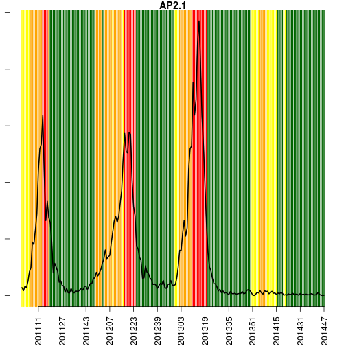 

```
## [1] "AP2.2"
##         SE       data   APS  tempmin casos_est       inc alertaClima
## 723 201440 2014-10-01 AP2.2 20.33333         3 0.8083639           0
## 720 201441 2014-10-08 AP2.2 19.42857        15 4.0418194           0
## 730 201442 2014-10-15 AP2.2 20.42857         4 1.0778185           0
## 727 201443 2014-10-22 AP2.2 20.71429         4 1.0778185           0
## 737 201444 2014-10-29 AP2.2 22.28571         6 1.6167277           0
## 747 201445 2014-11-05 AP2.2 22.00000         2 0.5389092           0
## 757 201446 2014-11-12 AP2.2 22.00000         4 1.0778185           0
## 754 201447 2014-11-19 AP2.2 20.16000         2 0.5389092           0
##     alertaTweet alertaTransmissao alertaCasos nivel
## 723           0                 0           0 verde
## 720           0                 0           0 verde
## 730           0                 0           0 verde
## 727           0                 0           0 verde
## 737           0                 0           0 verde
## 747           0                 0           0 verde
## 757           0                 0           0 verde
## 754           0                 0           0 verde
```

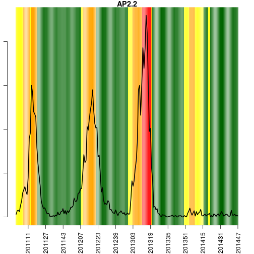 

```
## [1] "AP3.1"
##          SE       data   APS  tempmin casos_est       inc alertaClima
## 979  201440 2014-10-01 AP3.1 19.83333         6 0.8154523           0
## 976  201441 2014-10-08 AP3.1 17.14286         3 0.4077261           0
## 986  201442 2014-10-15 AP3.1 20.85714        11 1.4949958           0
## 983  201443 2014-10-22 AP3.1 20.28571         2 0.2718174           0
## 993  201444 2014-10-29 AP3.1 21.28571         2 0.2718174           0
## 1003 201445 2014-11-05 AP3.1 22.85714         3 0.4077261           0
## 1013 201446 2014-11-12 AP3.1 21.00000         3 0.4077261           0
## 1010 201447 2014-11-19 AP3.1 19.50000         0 0.0000000           0
##      alertaTweet alertaTransmissao alertaCasos nivel
## 979            0                 0           0 verde
## 976            0                 0           0 verde
## 986            0                 0           0 verde
## 983            0                 0           0 verde
## 993            0                 0           0 verde
## 1003           0                 0           0 verde
## 1013           0                 0           0 verde
## 1010           0                 0           0 verde
```

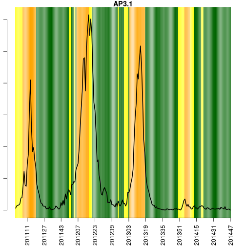 

```
## [1] "AP3.2"
##          SE       data   APS  tempmin casos_est       inc alertaClima
## 1237 201440 2014-10-01 AP3.2 19.83333         4 0.8167999           0
## 1234 201441 2014-10-08 AP3.2 17.14286         1 0.2042000           0
## 1231 201442 2014-10-15 AP3.2 20.85714         6 1.2251999           0
## 1241 201443 2014-10-22 AP3.2 20.28571         4 0.8167999           0
## 1251 201444 2014-10-29 AP3.2 21.28571         6 1.2251999           0
## 1261 201445 2014-11-05 AP3.2 22.85714         2 0.4084000           0
## 1258 201446 2014-11-12 AP3.2 21.00000         1 0.2042000           0
## 1268 201447 2014-11-19 AP3.2 19.50000         1 0.2042000           0
##      alertaTweet alertaTransmissao alertaCasos nivel
## 1237           0                 0           0 verde
## 1234           0                 0           0 verde
## 1231           0                 0           0 verde
## 1241           0                 0           0 verde
## 1251           0                 0           0 verde
## 1261           0                 0           0 verde
## 1258           0                 0           0 verde
## 1268           0                 0           0 verde
```

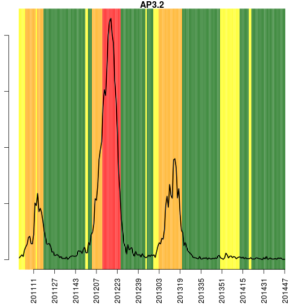 

```
## [1] "AP3.3"
##          SE       data   APS  tempmin casos_est       inc alertaClima
## 1523 201440 2014-10-01 AP3.3 19.83333         5 0.5409125           0
## 1520 201441 2014-10-08 AP3.3 17.14286         6 0.6490949           0
## 1526 201442 2014-10-15 AP3.3 20.85714        12 1.2981899           0
## 1527 201443 2014-10-22 AP3.3 20.28571         5 0.5409125           0
## 1524 201444 2014-10-29 AP3.3 21.28571         4 0.4327300           0
## 1521 201445 2014-11-05 AP3.3 22.85714         5 0.5409125           0
## 1529 201446 2014-11-12 AP3.3 21.00000         0 0.0000000           0
## 1528 201447 2014-11-19 AP3.3 19.50000         0 0.0000000           0
##      alertaTweet alertaTransmissao alertaCasos nivel
## 1523           0                 0           0 verde
## 1520           0                 0           0 verde
## 1526           0                 0           0 verde
## 1527           0                 0           0 verde
## 1524           0                 0           0 verde
## 1521           0                 0           0 verde
## 1529           0                 0           0 verde
## 1528           0                 0           0 verde
```

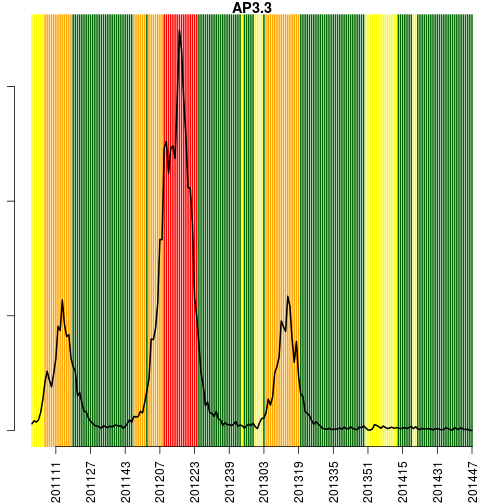 

```
## [1] "AP4"
##          SE       data APS  tempmin casos_est       inc alertaClima
## 1767 201440 2014-10-01 AP4 22.33333         6 0.7152590           0
## 1764 201441 2014-10-08 AP4 18.71429         4 0.4768393           0
## 1774 201442 2014-10-15 AP4 21.00000         8 0.9536786           0
## 1771 201443 2014-10-22 AP4 20.14286         4 0.4768393           0
## 1768 201444 2014-10-29 AP4 20.50000        44 5.2452325           0
## 1778 201445 2014-11-05 AP4 22.71429         4 0.4768393           0
## 1785 201446 2014-11-12 AP4 22.00000         4 0.4768393           0
## 1781 201447 2014-11-19 AP4 18.28000         5 0.5960491           0
##      alertaTweet alertaTransmissao alertaCasos nivel
## 1767           0                 0           0 verde
## 1764           0                 0           0 verde
## 1774           0                 0           0 verde
## 1771           0                 0           0 verde
## 1768           0                 0           0 verde
## 1778           0                 0           0 verde
## 1785           0                 0           0 verde
## 1781           0                 0           0 verde
```

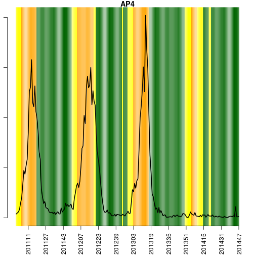 

```
## [1] "AP5.1"
##          SE       data   APS  tempmin casos_est       inc alertaClima
## 2023 201440 2014-10-01 AP5.1 19.57143        15 2.2870246           0
## 2020 201441 2014-10-08 AP5.1 16.42857        16 2.4394930           0
## 2030 201442 2014-10-15 AP5.1 19.85714        11 1.6771514           0
## 2027 201443 2014-10-22 AP5.1 19.14286        14 2.1345563           0
## 2024 201444 2014-10-29 AP5.1 20.00000         7 1.0672782           0
## 2034 201445 2014-11-05 AP5.1 22.14286         7 1.0672782           0
## 2040 201446 2014-11-12 AP5.1 22.00000         3 0.4574049           0
## 2028 201447 2014-11-19 AP5.1 17.28000         0 0.0000000           0
##      alertaTweet alertaTransmissao alertaCasos nivel
## 2023           0                 0           0 verde
## 2020           0                 0           0 verde
## 2030           0                 0           0 verde
## 2027           0                 0           0 verde
## 2024           0                 0           0 verde
## 2034           0                 0           0 verde
## 2040           0                 0           0 verde
## 2028           0                 0           0 verde
```

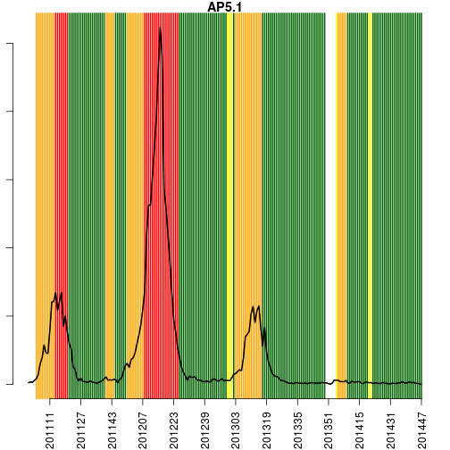 

```
## [1] "AP5.2"
##          SE       data   APS  tempmin casos_est       inc alertaClima
## 2224 201440 2014-10-01 AP5.2 19.57143        10 1.5033118           0
## 2234 201441 2014-10-08 AP5.2 16.42857         5 0.7516559           0
## 2231 201442 2014-10-15 AP5.2 19.85714         6 0.9019871           0
## 2241 201443 2014-10-22 AP5.2 19.14286         7 1.0523183           0
## 2251 201444 2014-10-29 AP5.2 20.00000        15 2.2549677           0
## 2261 201445 2014-11-05 AP5.2 22.14286         4 0.6013247           0
## 2271 201446 2014-11-12 AP5.2 22.00000         1 0.1503312           0
## 2281 201447 2014-11-19 AP5.2 17.28000         0 0.0000000           0
##      alertaTweet alertaTransmissao alertaCasos nivel
## 2224           0                 0           0 verde
## 2234           0                 0           0 verde
## 2231           0                 0           0 verde
## 2241           0                 0           0 verde
## 2251           0                 0           0 verde
## 2261           0                 0           0 verde
## 2271           0                 0           0 verde
## 2281           0                 0           0 verde
```

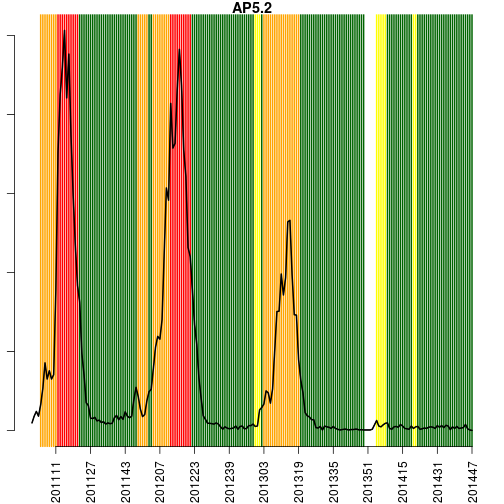 

```
## [1] "AP5.3"
##          SE       data   APS  tempmin casos_est       inc alertaClima
## 2480 201440 2014-10-01 AP5.3 19.57143         2 0.5426908           0
## 2490 201441 2014-10-08 AP5.3 16.42857         1 0.2713454           0
## 2500 201442 2014-10-15 AP5.3 19.85714         6 1.6280723           0
## 2510 201443 2014-10-22 AP5.3 19.14286         4 1.0853815           0
## 2520 201444 2014-10-29 AP5.3 20.00000         7 1.8994177           0
## 2530 201445 2014-11-05 AP5.3 22.14286         1 0.2713454           0
## 2540 201446 2014-11-12 AP5.3 22.00000         1 0.2713454           0
## 2550 201447 2014-11-19 AP5.3 17.28000         0 0.0000000           0
##      alertaTweet alertaTransmissao alertaCasos nivel
## 2480           0                 0           0 verde
## 2490           0                 0           0 verde
## 2500           0                 0           0 verde
## 2510           0                 0           0 verde
## 2520           0                 0           0 verde
## 2530           0                 0           0 verde
## 2540           0                 0           0 verde
## 2550           0                 0           0 verde
```

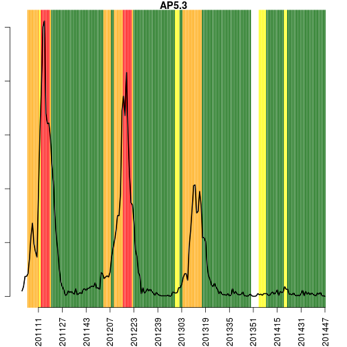 


**Confira o mapa da dengue em alerta.dengue.mat.br**

Notas
-----
- (1) Os dados do sinan mais recentes ainda nao foram totalmente digitados. Estimamos o numero esperado de casos
notificados considerando o tempo ate os casos serem digitados.
- (2) Os dados de tweets sao gerados pelo Observatorio de Dengue (UFMG). Os tweets sao processados para exclusao de informes e outros temas relacionados a dengue
- (3) Algumas vezes, os casos da ultima semana ainda nao estao disponiveis, nesse caso, usa-se uma estimacao com base na tendencia de variacao da serie 

Creditos
------
Esse e um projeto desenvolvido em parceria pela Fiocruz, FGV e Prefeitura do Rio de Janeiro, com apoio da SVS/MS

Mais detalhes, ver: www.dengue.mat.br
