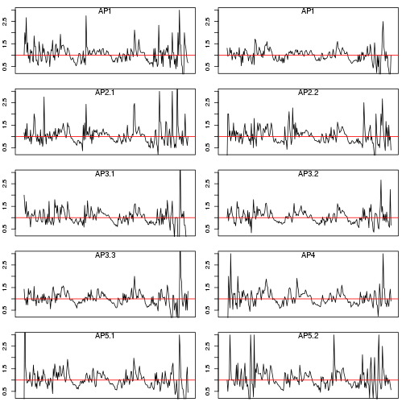
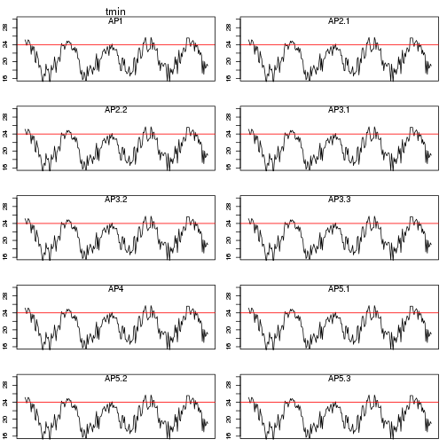
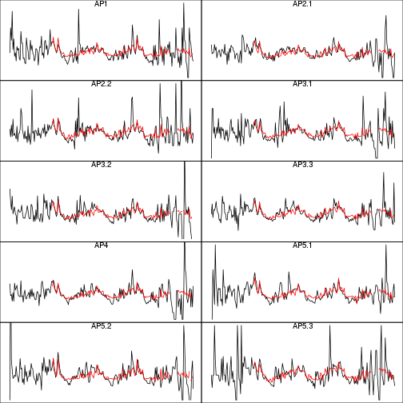

Alerta de Dengue para o Rio de Janeiro
======================
versao 0.2


**Hoje e' dia 2014-09-12 , SE 201437**


**Curvas epidemica da dengue na cidade**


Os ultimos dados disponiveis de casos de dengue se referem a'semana 201434:


```
##         SE  x
## 239 201430 25
## 240 201431 38
## 241 201432 31
## 242 201433 30
## 243 201434  5
## 244 201435 NA
```

 

**Curvas epidemicas da dengue por APS**

 


**Tweet na cidade**


Os ultimos dados disponiveis de tweet sao da semana 201435:


```
##          SE tweets
## 2435 201430     55
## 2436 201431     54
## 2437 201432     68
## 2438 201433     47
## 2439 201434     50
## 2440 201435     68
```

 

** Dados de temperatura mínima e máxima por APS**


Os ultimos dados disponiveis de temperatura minima sao da semana 201435. 


```
##   AP1 AP2.1 AP2.2 AP3.1 AP3.2 AP3.3   AP4 AP5.1 AP5.2 AP5.3 
##    17    17    17    17    17    17    17    17    17    17
```

 

** Dados de umidade mínima e máxima por APS**
 


Modelo de alerta com 5 indicadores
========

- Cli = Temperatura minima semanal > 22 graus por 3 semanas
- tw1 = crescimento significativo de tweet na ultima semana
- Rt =  (Rt > 1) por 3 semanas. Se nao houver notificacao, completar com o Rt dos tweets
- C = Casos > limiar de epidemia (300 por 100.000) 
- Rm = Mosquitos que aumentam significativamente


```
##        APS     SE tweets estacao casos temp.min temp.max umid.min umid.max
## 127    AP1 201435     68  galeao    NA       17       32       24       94
## 452  AP2.1 201435     68  galeao    NA       17       32       24       94
## 683  AP2.2 201435     68  galeao    NA       17       32       24       94
## 926  AP3.1 201435     68  galeao    NA       17       32       24       94
## 1184 AP3.2 201435     68  galeao    NA       17       32       24       94
## 1457 AP3.3 201435     68  galeao    NA       17       32       24       94
## 1701   AP4 201435     68  galeao    NA       17       32       24       94
## 1944 AP5.1 201435     68  galeao    NA       17       32       24       94
## 2171 AP5.2 201435     68  galeao    NA       17       32       24       94
## 2440 AP5.3 201435     68  galeao    NA       17       32       24       94
##      Pop2010
## 127   226963
## 452   552691
## 683   371120
## 926   735788
## 1184  489716
## 1457  924364
## 1701  838857
## 1944  655874
## 2171  665198
## 2440  368534
```


```r
#Cli = Alerta de Temperatura minima semanal > 22 graus por 3 semanas**

#Temperatura > Tcrit
detcli <- function(temp,tempcrit=22,lag=3){
    t1<-as.numeric(temp>tempcrit)
    le <- length(t1)
    ac <- t1[lag:le]
    for(i in 1:(lag-1)) ac <- ac+t1[(lag-i):(le-i)]
    c(rep(NA,(lag-1)),ac)
}

d2$Cli <- NA
for(i in 1:10) d2$Cli[which(d2$APS==listaAPS[i])] <-detcli(d$temp.min[d$APS==listaAPS[i]])
d2[d2$SE==max(d2$SE),]
```

```
##        APS     SE tweets estacao casos temp.min temp.max umid.min umid.max
## 127    AP1 201435     68  galeao    NA       17       32       24       94
## 452  AP2.1 201435     68  galeao    NA       17       32       24       94
## 683  AP2.2 201435     68  galeao    NA       17       32       24       94
## 926  AP3.1 201435     68  galeao    NA       17       32       24       94
## 1184 AP3.2 201435     68  galeao    NA       17       32       24       94
## 1457 AP3.3 201435     68  galeao    NA       17       32       24       94
## 1701   AP4 201435     68  galeao    NA       17       32       24       94
## 1944 AP5.1 201435     68  galeao    NA       17       32       24       94
## 2171 AP5.2 201435     68  galeao    NA       17       32       24       94
## 2440 AP5.3 201435     68  galeao    NA       17       32       24       94
##      Pop2010 Cli
## 127   226963   0
## 452   552691   0
## 683   371120   0
## 926   735788   0
## 1184  489716   0
## 1457  924364   0
## 1701  838857   0
## 1944  655874   0
## 2171  665198   0
## 2440  368534   0
```


```
##        APS     SE tweets estacao casos temp.min temp.max umid.min umid.max
## 127    AP1 201435     68  galeao    NA       17       32       24       94
## 452  AP2.1 201435     68  galeao    NA       17       32       24       94
## 683  AP2.2 201435     68  galeao    NA       17       32       24       94
## 926  AP3.1 201435     68  galeao    NA       17       32       24       94
## 1184 AP3.2 201435     68  galeao    NA       17       32       24       94
## 1457 AP3.3 201435     68  galeao    NA       17       32       24       94
## 1701   AP4 201435     68  galeao    NA       17       32       24       94
## 1944 AP5.1 201435     68  galeao    NA       17       32       24       94
## 2171 AP5.2 201435     68  galeao    NA       17       32       24       94
## 2440 AP5.3 201435     68  galeao    NA       17       32       24       94
##      Pop2010 Cli Rtw ptw1  Rtwlr Rtwur twgreat1 ac.twgreat1
## 127   226963   0   1  0.5 0.8021 1.232        0           0
## 452   552691   0   1  0.5 0.8021 1.232        0           0
## 683   371120   0   1  0.5 0.8021 1.232        0           0
## 926   735788   0   1  0.5 0.8021 1.232        0           0
## 1184  489716   0   1  0.5 0.8021 1.232        0           0
## 1457  924364   0   1  0.5 0.8021 1.232        0           0
## 1701  838857   0   1  0.5 0.8021 1.232        0           0
## 1944  655874   0   1  0.5 0.8021 1.232        0           0
## 2171  665198   0   1  0.5 0.8021 1.232        0           0
## 2440  368534   0   1  0.5 0.8021 1.232        0           0
```


```
##        APS     SE tweets estacao casos temp.min temp.max umid.min umid.max
## 127    AP1 201435     68  galeao    NA       17       32       24       94
## 452  AP2.1 201435     68  galeao    NA       17       32       24       94
## 683  AP2.2 201435     68  galeao    NA       17       32       24       94
## 926  AP3.1 201435     68  galeao    NA       17       32       24       94
## 1184 AP3.2 201435     68  galeao    NA       17       32       24       94
## 1457 AP3.3 201435     68  galeao    NA       17       32       24       94
## 1701   AP4 201435     68  galeao    NA       17       32       24       94
## 1944 AP5.1 201435     68  galeao    NA       17       32       24       94
## 2171 AP5.2 201435     68  galeao    NA       17       32       24       94
## 2440 AP5.3 201435     68  galeao    NA       17       32       24       94
##      Pop2010 Cli Rtw ptw1  Rtwlr Rtwur twgreat1 ac.twgreat1 Rt pRt1 Rtlr
## 127   226963   0   1  0.5 0.8021 1.232        0           0 NA   NA   NA
## 452   552691   0   1  0.5 0.8021 1.232        0           0 NA   NA   NA
## 683   371120   0   1  0.5 0.8021 1.232        0           0 NA   NA   NA
## 926   735788   0   1  0.5 0.8021 1.232        0           0 NA   NA   NA
## 1184  489716   0   1  0.5 0.8021 1.232        0           0 NA   NA   NA
## 1457  924364   0   1  0.5 0.8021 1.232        0           0 NA   NA   NA
## 1701  838857   0   1  0.5 0.8021 1.232        0           0 NA   NA   NA
## 1944  655874   0   1  0.5 0.8021 1.232        0           0 NA   NA   NA
## 2171  665198   0   1  0.5 0.8021 1.232        0           0 NA   NA   NA
## 2440  368534   0   1  0.5 0.8021 1.232        0           0 NA   NA   NA
##      Rtur
## 127    NA
## 452    NA
## 683    NA
## 926    NA
## 1184   NA
## 1457   NA
## 1701   NA
## 1944   NA
## 2171   NA
## 2440   NA
```

```
##        APS     SE tweets estacao casos temp.min temp.max umid.min umid.max
## 127    AP1 201435     68  galeao    NA       17       32       24       94
## 452  AP2.1 201435     68  galeao    NA       17       32       24       94
## 683  AP2.2 201435     68  galeao    NA       17       32       24       94
## 926  AP3.1 201435     68  galeao    NA       17       32       24       94
## 1184 AP3.2 201435     68  galeao    NA       17       32       24       94
## 1457 AP3.3 201435     68  galeao    NA       17       32       24       94
## 1701   AP4 201435     68  galeao    NA       17       32       24       94
## 1944 AP5.1 201435     68  galeao    NA       17       32       24       94
## 2171 AP5.2 201435     68  galeao    NA       17       32       24       94
## 2440 AP5.3 201435     68  galeao    NA       17       32       24       94
##      Pop2010 Cli Rtw ptw1  Rtwlr Rtwur twgreat1 ac.twgreat1 Rt pRt1 Rtlr
## 127   226963   0   1  0.5 0.8021 1.232        0           0 NA   NA   NA
## 452   552691   0   1  0.5 0.8021 1.232        0           0 NA   NA   NA
## 683   371120   0   1  0.5 0.8021 1.232        0           0 NA   NA   NA
## 926   735788   0   1  0.5 0.8021 1.232        0           0 NA   NA   NA
## 1184  489716   0   1  0.5 0.8021 1.232        0           0 NA   NA   NA
## 1457  924364   0   1  0.5 0.8021 1.232        0           0 NA   NA   NA
## 1701  838857   0   1  0.5 0.8021 1.232        0           0 NA   NA   NA
## 1944  655874   0   1  0.5 0.8021 1.232        0           0 NA   NA   NA
## 2171  665198   0   1  0.5 0.8021 1.232        0           0 NA   NA   NA
## 2440  368534   0   1  0.5 0.8021 1.232        0           0 NA   NA   NA
##      Rtur pRti Rti Rtgreat1 ac.Rtgreat1
## 127    NA  0.5   1        0           0
## 452    NA  0.5   1        0           1
## 683    NA  0.5   1        0           0
## 926    NA  0.5   1        0           0
## 1184   NA  0.5   1        0           0
## 1457   NA  0.5   1        0           0
## 1701   NA  0.5   1        0           2
## 1944   NA  0.5   1        0           0
## 2171   NA  0.5   1        0           0
## 2440   NA  0.5   1        0           1
```

**Grafico de Prob(Rt > 1)**

 


```
##        APS     SE tweets estacao casos temp.min temp.max umid.min umid.max
## 127    AP1 201435     68  galeao    NA       17       32       24       94
## 452  AP2.1 201435     68  galeao    NA       17       32       24       94
## 683  AP2.2 201435     68  galeao    NA       17       32       24       94
## 926  AP3.1 201435     68  galeao    NA       17       32       24       94
## 1184 AP3.2 201435     68  galeao    NA       17       32       24       94
## 1457 AP3.3 201435     68  galeao    NA       17       32       24       94
## 1701   AP4 201435     68  galeao    NA       17       32       24       94
## 1944 AP5.1 201435     68  galeao    NA       17       32       24       94
## 2171 AP5.2 201435     68  galeao    NA       17       32       24       94
## 2440 AP5.3 201435     68  galeao    NA       17       32       24       94
##      Pop2010 Cli Rtw ptw1  Rtwlr Rtwur twgreat1 ac.twgreat1 Rt pRt1 Rtlr
## 127   226963   0   1  0.5 0.8021 1.232        0           0 NA   NA   NA
## 452   552691   0   1  0.5 0.8021 1.232        0           0 NA   NA   NA
## 683   371120   0   1  0.5 0.8021 1.232        0           0 NA   NA   NA
## 926   735788   0   1  0.5 0.8021 1.232        0           0 NA   NA   NA
## 1184  489716   0   1  0.5 0.8021 1.232        0           0 NA   NA   NA
## 1457  924364   0   1  0.5 0.8021 1.232        0           0 NA   NA   NA
## 1701  838857   0   1  0.5 0.8021 1.232        0           0 NA   NA   NA
## 1944  655874   0   1  0.5 0.8021 1.232        0           0 NA   NA   NA
## 2171  665198   0   1  0.5 0.8021 1.232        0           0 NA   NA   NA
## 2440  368534   0   1  0.5 0.8021 1.232        0           0 NA   NA   NA
##      Rtur pRti Rti Rtgreat1 ac.Rtgreat1 casos_est    inc
## 127    NA  0.5   1        0           0    0.0000 0.0000
## 452    NA  0.5   1        0           1    3.6667 0.6634
## 683    NA  0.5   1        0           0    0.5833 0.1572
## 926    NA  0.5   1        0           0    2.8214 0.3835
## 1184   NA  0.5   1        0           0    3.8222 0.7805
## 1457   NA  0.5   1        0           0    1.4464 0.1565
## 1701   NA  0.5   1        0           2    4.1667 0.4967
## 1944   NA  0.5   1        0           0    4.0808 0.6222
## 2171   NA  0.5   1        0           0    7.3397 1.1034
## 2440   NA  0.5   1        0           1    0.8874 0.2408
```


**Alerta por APS**

Para cada APS, indica-se as semanas em que houve alerta de temperatura, de Rt e de casos.

```
## [1] "AP1"
##         SE APS Cli ac.Rtgreat1 alertaCasos
## 241 201430 AP1   0           0           0
## 238 201431 AP1   0           0           0
## 235 201432 AP1   0           0           0
## 244 201433 AP1   0           0           0
## 242 201434 AP1   0           0           0
## 127 201435 AP1   0           0           0
```

```
## [1] "AP2.1"
##         SE   APS Cli ac.Rtgreat1 alertaCasos
## 471 201430 AP2.1   0           0           0
## 468 201431 AP2.1   0           0           0
## 478 201432 AP2.1   0           0           0
## 475 201433 AP2.1   0           1           0
## 472 201434 AP2.1   0           1           0
## 452 201435 AP2.1   0           1           0
```

```
## [1] "AP2.2"
##         SE   APS Cli ac.Rtgreat1 alertaCasos
## 646 201430 AP2.2   0           1           0
## 656 201431 AP2.2   0           0           0
## 666 201432 AP2.2   0           0           0
## 676 201433 AP2.2   0           0           0
## 686 201434 AP2.2   0           0           0
## 683 201435 AP2.2   0           0           0
```

```
## [1] "AP3.1"
##         SE   APS Cli ac.Rtgreat1 alertaCasos
## 945 201430 AP3.1   0           0           0
## 955 201431 AP3.1   0           0           0
## 965 201432 AP3.1   0           0           0
## 962 201433 AP3.1   0           0           0
## 972 201434 AP3.1   0           0           0
## 926 201435 AP3.1   0           0           0
```

```
## [1] "AP3.2"
##          SE   APS Cli ac.Rtgreat1 alertaCasos
## 1216 201430 AP3.2   0           0           0
## 1213 201431 AP3.2   0           0           0
## 1214 201432 AP3.2   0           0           0
## 1211 201433 AP3.2   0           0           0
## 1208 201434 AP3.2   0           0           0
## 1184 201435 AP3.2   0           0           0
```

```
## [1] "AP3.3"
##          SE   APS Cli ac.Rtgreat1 alertaCasos
## 1450 201430 AP3.3   0           0           0
## 1460 201431 AP3.3   0           0           0
## 1464 201432 AP3.3   0           0           0
## 1454 201433 AP3.3   0           0           0
## 1451 201434 AP3.3   0           0           0
## 1457 201435 AP3.3   0           0           0
```

```
## [1] "AP4"
##          SE APS Cli ac.Rtgreat1 alertaCasos
## 1677 201430 AP4   0           0           0
## 1687 201431 AP4   0           0           0
## 1684 201432 AP4   0           1           0
## 1694 201433 AP4   0           2           0
## 1704 201434 AP4   0           2           0
## 1701 201435 AP4   0           2           0
```

```
## [1] "AP5.1"
##          SE   APS Cli ac.Rtgreat1 alertaCasos
## 1946 201430 AP5.1   0           0           0
## 1943 201431 AP5.1   0           0           0
## 1940 201432 AP5.1   0           0           0
## 1937 201433 AP5.1   0           0           0
## 1947 201434 AP5.1   0           0           0
## 1944 201435 AP5.1   0           0           0
```

```
## [1] "AP5.2"
##          SE   APS Cli ac.Rtgreat1 alertaCasos
## 2121 201430 AP5.2   0           0           0
## 2131 201431 AP5.2   0           0           0
## 2141 201432 AP5.2   0           0           0
## 2151 201433 AP5.2   0           0           0
## 2161 201434 AP5.2   0           0           0
## 2171 201435 AP5.2   0           0           0
```

```
## [1] "AP5.3"
##          SE   APS Cli ac.Rtgreat1 alertaCasos
## 2390 201430 AP5.3   0           0           0
## 2400 201431 AP5.3   0           1           0
## 2410 201432 AP5.3   0           2           0
## 2420 201433 AP5.3   0           2           0
## 2430 201434 AP5.3   0           2           0
## 2440 201435 AP5.3   0           1           0
```

 


**Salvar**


```
## Error: objeto 'd4' não encontrado
```

```
## Error: objeto 'd4' não encontrado
```


```
## Error: objeto de tipo 'closure' não possível dividir em subconjuntos
```


