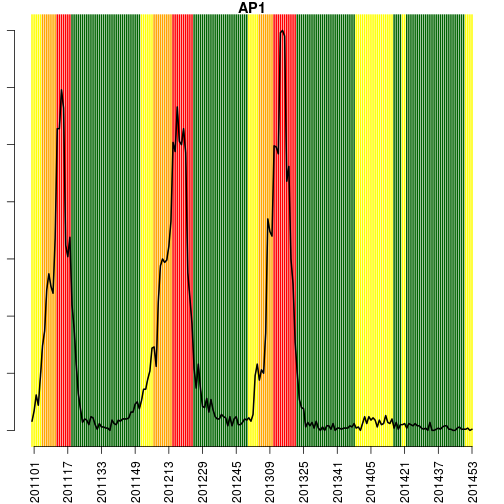
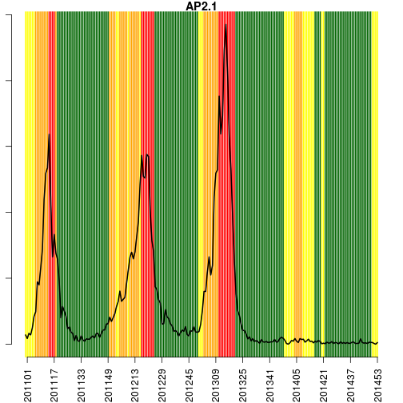
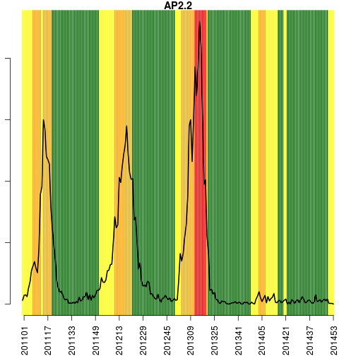
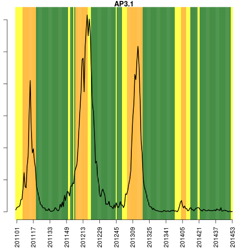
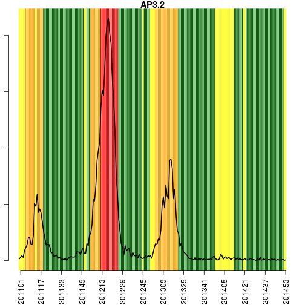
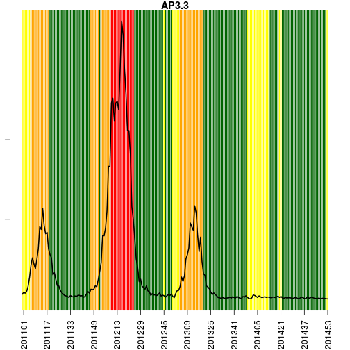
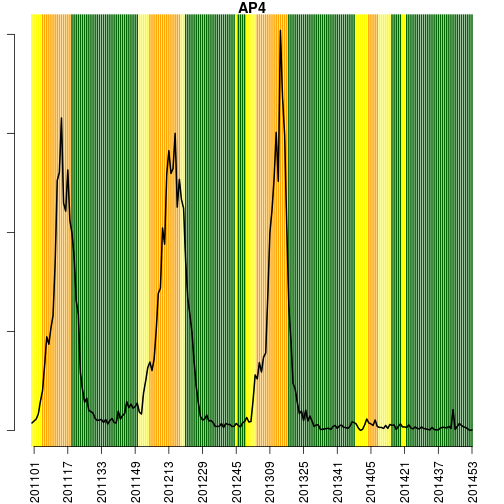
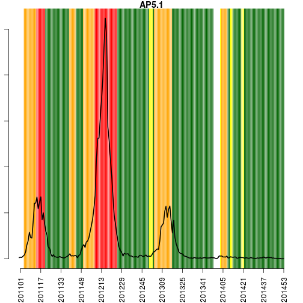
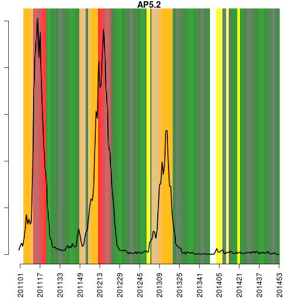
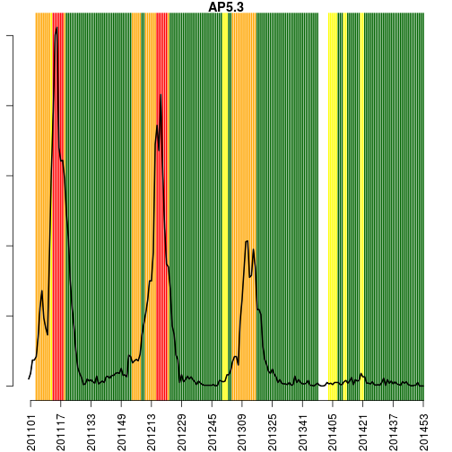

**Rio de Janeiro, 2014-12-29  (SE 201453)**

* [Na cidade](#tab1)

* [Por APS](#tab2)

   

###  Situação na cidade do Rio de Janeiro

 

\pagebreak

Últimas 6 semanas:

-----------------------------------------------------------
 &nbsp;     SE    casos   casos_corrigidos   tweets   Tmin 
--------- ------ ------- ------------------ -------- ------
 **255**  201447   49          58.61           50    18.89 

 **256**  201448   34          42.77           46    22.34 

 **257**  201449   41          55.56           40    21.48 

 **258**  201450   27          41.41           46    22.91 

 **259**  201451   11          20.72           28    21.87 

 **260**  201452   NA            NA            40    24.35 
-----------------------------------------------------------

Legenda:

- SE: semana epidemiológica
- casos: nímero de casos de dengue no SINAN
- casos_corrigidos: estimativa do número de casos notificados (ver [Notas](#notas))
- tweets: número de tweets relatando sintomas de dengue (ver [Notas](#notas))
- Tmin: média das temperaturas mínimas da semana

   
   

**Alerta por APS**

Código:

*Verde (atividade baixa)*
   temperatura < 22 graus por 3 semanas 
   atividade de tweet normal (não aumentada)
   ausência de transmissão sustentada

*Amarelo (Alerta)*
   temperatura > 22C por mais de 3 semanas
   ou atividade de tweet aumentada

*Laranja (Transmissão sustentada)*
  número reprodutivo >1 por 3 semanas

*Vermelho (atividade alta)*
 incidência > 100:100.000

###  Alerta APS 1

 

   

Histórico da APS 1

-----------------------------------------------------------------------------------
 &nbsp;     SE    temp   casos   inc    AClima   ATweet   ATransm   ACasos   nivel 
--------- ------ ------ ------- ------ -------- -------- --------- -------- -------
 **255**  201447 20.17     4    1.762     0        0         0        0      verde 

 **256**  201448   22      2    0.8812    0        0         0        0      verde 

 **257**  201449 22.14     0      0       0        0         0        0      verde 

 **258**  201450 22.86     1    0.4406    1        0         0        0     amarelo

 **259**  201451 22.71     2    0.8812    1        0         0        0     amarelo

 **260**  201452 24.43  0.5547  0.2444    1        0         0        0     amarelo
-----------------------------------------------------------------------------------

###  Alerta APS 2.1

 

   

Histórico da AP2.1

-----------------------------------------------------------------------------------
 &nbsp;     SE    temp   casos   inc    AClima   ATweet   ATransm   ACasos   nivel 
--------- ------ ------ ------- ------ -------- -------- --------- -------- -------
 **515**  201447 20.17     2    0.3619    0        0         0        0      verde 

 **516**  201448   22      6    1.086     0        0         0        0      verde 

 **517**  201449 22.14     5    0.9047    0        0         0        0      verde 

 **518**  201450 22.86     5    0.9047    1        0         0        0     amarelo

 **519**  201451 22.71     1    0.1809    1        0         0        0     amarelo

 **520**  201452 24.43   6.578   1.19     1        0         0        0     amarelo
-----------------------------------------------------------------------------------

###  Alerta APS 2.2

 

   

Histórico da AP2.2

-----------------------------------------------------------------------------------
 &nbsp;     SE    temp   casos   inc    AClima   ATweet   ATransm   ACasos   nivel 
--------- ------ ------ ------- ------ -------- -------- --------- -------- -------
 **775**  201447 20.17     7    1.886     0        0         0        0      verde 

 **776**  201448   22      5    1.347     0        0         0        0      verde 

 **777**  201449 22.14    10    2.695     0        0         0        0      verde 

 **778**  201450 22.86     1    0.2695    1        0         0        0     amarelo

 **779**  201451 22.71     0      0       1        0         0        0     amarelo

 **780**  201452 24.43  0.7576  0.2041    1        0         0        0     amarelo
-----------------------------------------------------------------------------------

###  Alerta APS 3.1

 

   

Histórico da AP3.1

------------------------------------------------------------------------------------
  &nbsp;     SE    temp   casos   inc    AClima   ATweet   ATransm   ACasos   nivel 
---------- ------ ------ ------- ------ -------- -------- --------- -------- -------
 **1035**  201447 19.43     3    0.4077    0        0         0        0      verde 

 **1036**  201448 22.67     3    0.4077    0        0         0        0      verde 

 **1037**  201449 21.86     0      0       0        0         0        0      verde 

 **1038**  201450 23.33     0      0       0        0         0        0      verde 

 **1039**  201451 22.29     0      0       0        0         0        0      verde 

 **1040**  201452  24.6     0      0       1        0         0        0     amarelo
------------------------------------------------------------------------------------

###  Alerta APS 3.2

 

   

Histórico da AP3.2

------------------------------------------------------------------------------------
  &nbsp;     SE    temp   casos   inc    AClima   ATweet   ATransm   ACasos   nivel 
---------- ------ ------ ------- ------ -------- -------- --------- -------- -------
 **1295**  201447 19.43     4    0.8168    0        0         0        0      verde 

 **1296**  201448 22.67     1    0.2042    0        0         0        0      verde 

 **1297**  201449 21.86     2    0.4084    0        0         0        0      verde 

 **1298**  201450 23.33     2    0.4084    0        0         0        0      verde 

 **1299**  201451 22.29     2    0.4084    0        0         0        0      verde 

 **1300**  201452  24.6   1.608  0.3283    1        0         0        0     amarelo
------------------------------------------------------------------------------------

###  Alerta APS 3.3

 

   

Histórico da AP3.3

-------------------------------------------------------------------------------------
  &nbsp;     SE    temp   casos    inc    AClima   ATweet   ATransm   ACasos   nivel 
---------- ------ ------ ------- ------- -------- -------- --------- -------- -------
 **1555**  201447 19.43     6    0.6491     0        0         0        0      verde 

 **1556**  201448 22.67     0       0       0        0         0        0      verde 

 **1557**  201449 21.86     5    0.5409     0        0         0        0      verde 

 **1558**  201450 23.33     1    0.1082     0        0         0        0      verde 

 **1559**  201451 22.29     3    0.3245     0        0         0        0      verde 

 **1560**  201452  24.6  0.5956  0.06443    1        0         0        0     amarelo
-------------------------------------------------------------------------------------

###  Alerta APS 4

 

   

Histórico da AP4

------------------------------------------------------------------------------------
  &nbsp;     SE    temp   casos   inc    AClima   ATweet   ATransm   ACasos   nivel 
---------- ------ ------ ------- ------ -------- -------- --------- -------- -------
 **1815**  201447 18.29    14    1.669     0        0         0        0      verde 

 **1816**  201448   23      9    1.073     0        0         0        0      verde 

 **1817**  201449 21.29     7    0.8345    0        0         0        0      verde 

 **1818**  201450   22      5    0.596     0        0         0        0      verde 

 **1819**  201451 21.57     2    0.2384    0        0         0        0      verde 

 **1820**  201452 25.43   3.791  0.452     0        0         0        0      verde 
------------------------------------------------------------------------------------

###  Alerta APS 5.1

 

   

Histórico da AP5.1

------------------------------------------------------------------------------------
  &nbsp;     SE    temp   casos   inc    AClima   ATweet   ATransm   ACasos   nivel 
---------- ------ ------ ------- ------ -------- -------- --------- -------- -------
 **2075**  201447 17.29     6    0.9148    0        0         0        0      verde 

 **2076**  201448 22.14     3    0.4574    0        0         0        0      verde 

 **2077**  201449  20.5     3    0.4574    0        0         0        0      verde 

 **2078**  201450 22.83     4    0.6099    0        0         0        0      verde 

 **2079**  201451 20.71     0      0       0        0         0        0      verde 

 **2080**  201452 23.67   3.722  0.5676    0        0         0        0      verde 
------------------------------------------------------------------------------------

###  Alerta APS 5.2

 

   

Histórico da AP5.2

------------------------------------------------------------------------------------
  &nbsp;     SE    temp   casos   inc    AClima   ATweet   ATransm   ACasos   nivel 
---------- ------ ------ ------- ------ -------- -------- --------- -------- -------
 **2335**  201447 17.29     3    0.451     0        0         0        0      verde 

 **2336**  201448 22.14     4    0.6013    0        0         0        0      verde 

 **2337**  201449  20.5     7    1.052     0        0         0        0      verde 

 **2338**  201450 22.83     3    0.451     0        0         0        0      verde 

 **2339**  201451 20.71     1    0.1503    0        0         0        0      verde 

 **2340**  201452 23.67   3.168  0.4762    0        0         0        0      verde 
------------------------------------------------------------------------------------

###  Alerta APS 5.3

 

   

Histórico da AP5.3

------------------------------------------------------------------------------------
  &nbsp;     SE    temp   casos   inc    AClima   ATweet   ATransm   ACasos   nivel 
---------- ------ ------ ------- ------ -------- -------- --------- -------- -------
 **2595**  201447 17.29     0      0       0        0         0        0      verde 

 **2596**  201448 22.14     1    0.2713    0        0         0        0      verde 

 **2597**  201449  20.5     2    0.5427    0        0         0        0      verde 

 **2598**  201450 22.83     5    1.357     0        0         0        0      verde 

 **2599**  201451 20.71     0      0       0        0         0        0      verde 

 **2600**  201452 23.67   14.66  3.979     0        0         0        0      verde 
------------------------------------------------------------------------------------

###  Notas

- Os dados do sinan mais recentes ainda não foram totalmente digitados. Estimamos o número esperado de casos
notificados considerando o tempo ate os casos serem digitados.
- Os dados de tweets são gerados pelo Observatório de Dengue (UFMG). Os tweets são processados para exclusão de informes e outros temas relacionados a dengue
- Algumas vezes, os casos da última semana ainda não estao disponiveis, nesse caso, usa-se uma estimação com base na tendência de variação da serie 

Créditos
------
Esse e um projeto desenvolvido em parceria pela Fiocruz, FGV e Prefeitura do Rio de Janeiro, com apoio da SVS/MS

Mais detalhes, ver: www.dengue.mat.br

