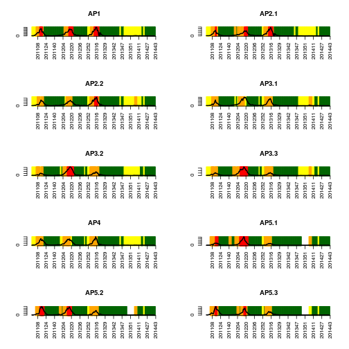
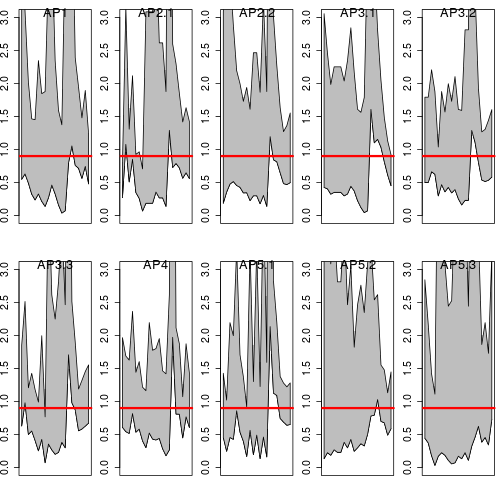
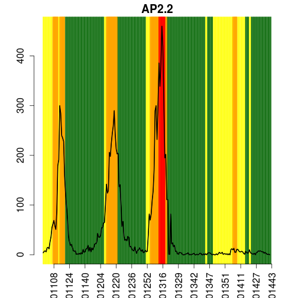
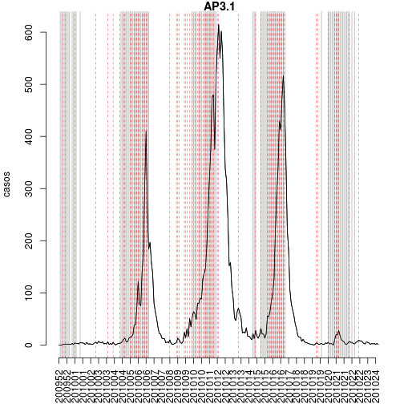
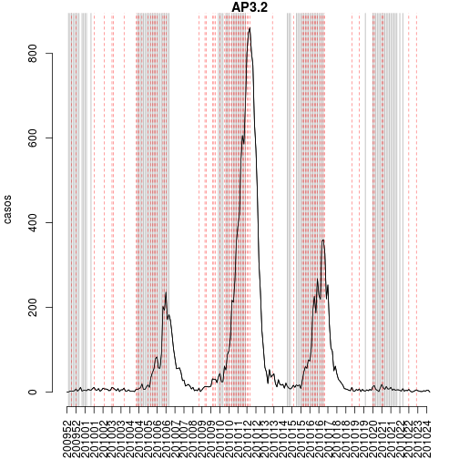
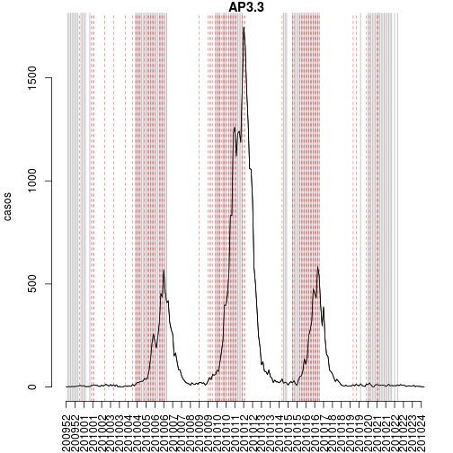
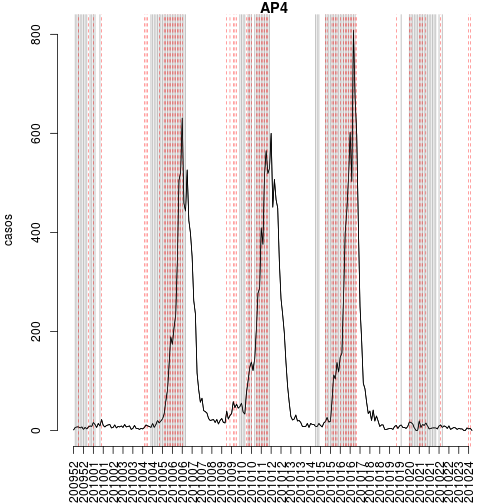
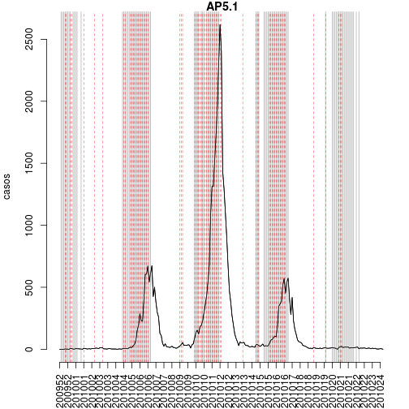
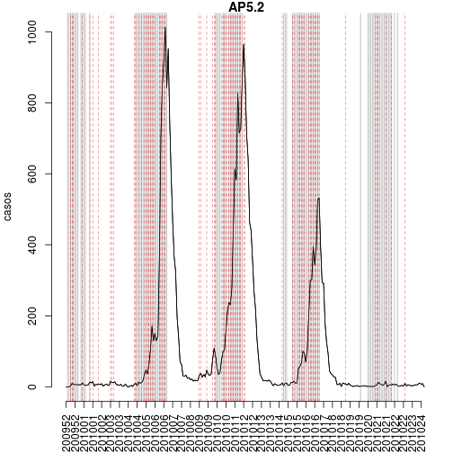
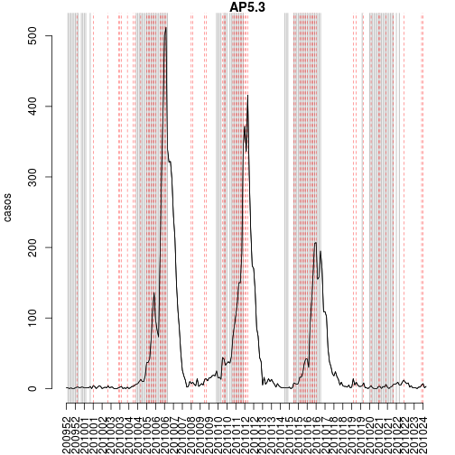

Alerta de Dengue a nivel de APS - Rio de Janeiro
======================
versao 0.1


**Hoje e' dia 2014-09-08 , SE 201437**


**Curvas epidemicas da dengue por APS (periodo: 2010-)**


Os ultimos dados disponiveis de casos de dengue se referem a'semana 201434:

 


**Rt(dengue) com intervalo de confiança**

 

**Probabilidade do Rt>1**
 


**Tweet na cidade**


Os ultimos dados disponiveis de tweet sao da semana 201435:


```
##          SE tweets
## 2435 201430     55
## 2436 201431     54
## 2437 201432     68
## 2438 201433     47
## 2439 201434     50
## 2440 201435     68
```

 


**Temperatura**


Os ultimos dados disponiveis de temperatura minima sao da semana 201435. 


```
##   AP1 AP2.1 AP2.2 AP3.1 AP3.2 AP3.3   AP4 AP5.1 AP5.2 AP5.3 
##    17    17    17    17    17    17    17    17    17    17
```

 


      

Modelo de alerta com 3 indicadores
========

- Temperatura minima semanal > 22 graus  : condicoes propicias para o desenvolvimento do vetor
- p(Rt > 1)>0.8 : semana com alta probabilidade de Rt>1
- Casos > miliar (por fazer) 


```r
#Rt_est>1
d3$alertaRt1 <-ifelse(d3$p1>0.8,1,0)
```


```r
#Temperatura > Tcrit
d3$temp_crit <- 22
d3$alertaTemp <-ifelse(d3$temp.min>d3$temp_crit,1,0)
```


**Alerta por APS**

Para cada APS, indica-se as semanas em que houve alerta de temperatura, de Rt e de casos.
O alerta e' indicado pela linha cinza no grafico.

Tambem mostramos para cada APS, os valores dos indicadores nas ultimas 6 semanas. Esses indicadores
serao usados para criar o codigo de cores do alerta.


```
## [1] "AP1"
##          SE APS alertaTemp alertaRt1 alertaCasos
## 2381 201430 AP1          0         0          NA
## 2391 201431 AP1          0         0          NA
## 2401 201432 AP1          0         0          NA
## 2411 201433 AP1          0         0          NA
## 2421 201434 AP1          0         0          NA
## 2431 201435 AP1          0        NA          NA
```

 

```
## [1] "AP2.1"
##          SE   APS alertaTemp alertaRt1 alertaCasos
## 2382 201430 AP2.1          0         0          NA
## 2392 201431 AP2.1          0         0          NA
## 2402 201432 AP2.1          0         0          NA
## 2412 201433 AP2.1          0         1          NA
## 2422 201434 AP2.1          0         0          NA
## 2432 201435 AP2.1          0        NA          NA
```

 

```
## [1] "AP2.2"
##          SE   APS alertaTemp alertaRt1 alertaCasos
## 2383 201430 AP2.2          0         0          NA
## 2393 201431 AP2.2          0         0          NA
## 2403 201432 AP2.2          0         0          NA
## 2413 201433 AP2.2          0         0          NA
## 2423 201434 AP2.2          0         0          NA
## 2433 201435 AP2.2          0        NA          NA
```

 

```
## [1] "AP3.1"
##          SE   APS alertaTemp alertaRt1 alertaCasos
## 2384 201430 AP3.1          0         0          NA
## 2394 201431 AP3.1          0         0          NA
## 2404 201432 AP3.1          0         0          NA
## 2414 201433 AP3.1          0         0          NA
## 2424 201434 AP3.1          0         0          NA
## 2434 201435 AP3.1          0        NA          NA
```

 

```
## [1] "AP3.2"
##          SE   APS alertaTemp alertaRt1 alertaCasos
## 2385 201430 AP3.2          0         0          NA
## 2395 201431 AP3.2          0         0          NA
## 2405 201432 AP3.2          0         0          NA
## 2415 201433 AP3.2          0         0          NA
## 2425 201434 AP3.2          0         0          NA
## 2435 201435 AP3.2          0        NA          NA
```

 

```
## [1] "AP3.3"
##          SE   APS alertaTemp alertaRt1 alertaCasos
## 2386 201430 AP3.3          0         0          NA
## 2396 201431 AP3.3          0         0          NA
## 2406 201432 AP3.3          0         0          NA
## 2416 201433 AP3.3          0         0          NA
## 2426 201434 AP3.3          0         0          NA
## 2436 201435 AP3.3          0        NA          NA
```

 

```
## [1] "AP4"
##          SE APS alertaTemp alertaRt1 alertaCasos
## 2387 201430 AP4          0         0          NA
## 2397 201431 AP4          0         0          NA
## 2407 201432 AP4          0         1          NA
## 2417 201433 AP4          0         1          NA
## 2427 201434 AP4          0         0          NA
## 2437 201435 AP4          0        NA          NA
```

 

```
## [1] "AP5.1"
##          SE   APS alertaTemp alertaRt1 alertaCasos
## 2388 201430 AP5.1          0         0          NA
## 2398 201431 AP5.1          0         0          NA
## 2408 201432 AP5.1          0         0          NA
## 2418 201433 AP5.1          0         0          NA
## 2428 201434 AP5.1          0         0          NA
## 2438 201435 AP5.1          0        NA          NA
```

 

```
## [1] "AP5.2"
##          SE   APS alertaTemp alertaRt1 alertaCasos
## 2389 201430 AP5.2          0         0          NA
## 2399 201431 AP5.2          0         0          NA
## 2409 201432 AP5.2          0         0          NA
## 2419 201433 AP5.2          0         0          NA
## 2429 201434 AP5.2          0         0          NA
## 2439 201435 AP5.2          0        NA          NA
```

 

```
## [1] "AP5.3"
##          SE   APS alertaTemp alertaRt1 alertaCasos
## 2390 201430 AP5.3          0         0          NA
## 2400 201431 AP5.3          0         1          NA
## 2410 201432 AP5.3          0         1          NA
## 2420 201433 AP5.3          0         0          NA
## 2430 201434 AP5.3          0         0          NA
## 2440 201435 AP5.3          0        NA          NA
```

 


**Salvar**


```
## Error: undefined columns selected
```


- **Data do alerta: 201434**
- Arquivo de saida: ../alerta/alertaAPS_201434.csv  


