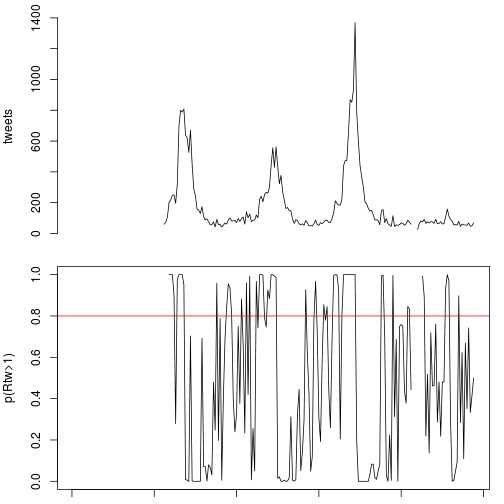
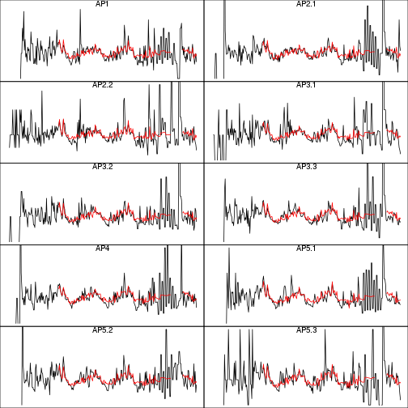
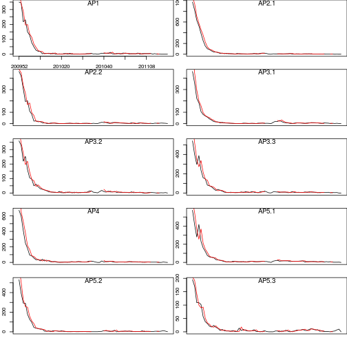
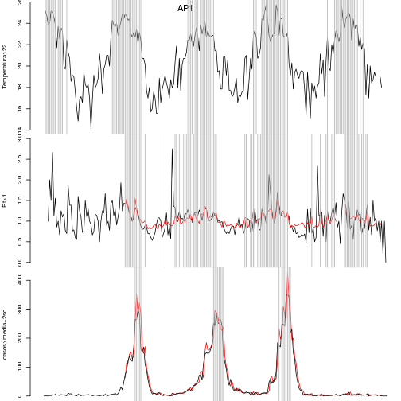
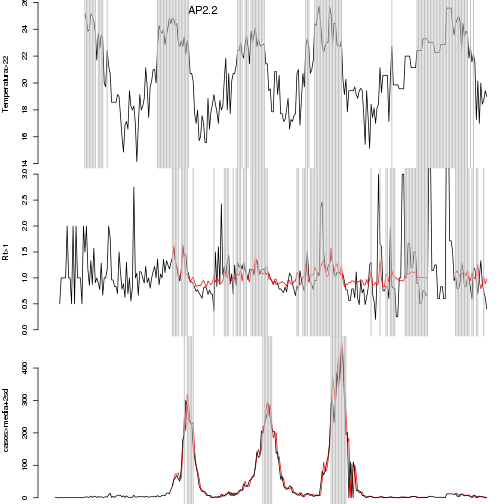
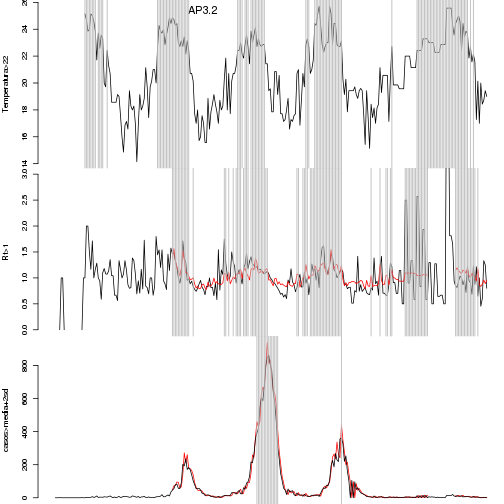
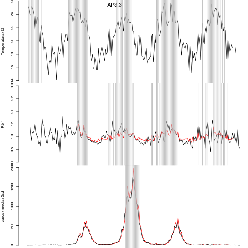
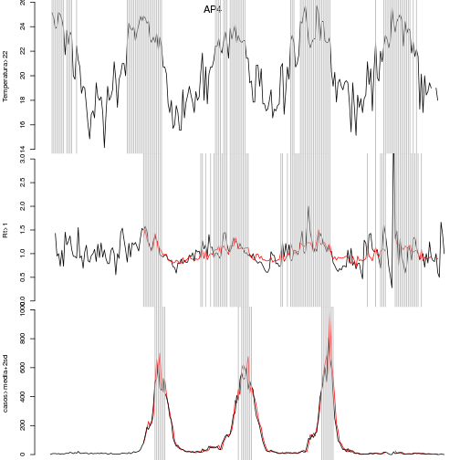
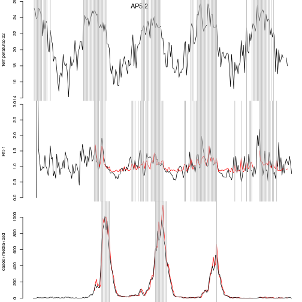
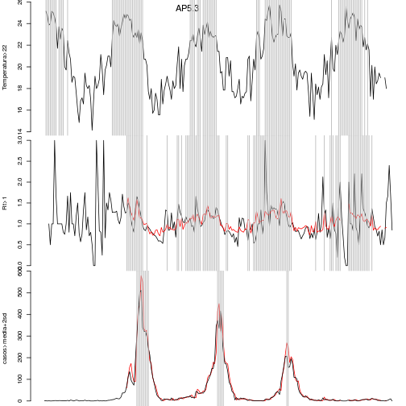

Alerta de Dengue a nivel de APS - Rio de Janeiro
======================
versao 0.1


**Hoje e' dia 2014-08-22 , SE 201434**


**Curvas epidemicas da dengue por APS (periodo: 2010-)**


 


Os ultimos dados disponiveis de casos de dengue se referem a'semana 201433:


```
##   AP1 AP2.1 AP2.2 AP3.1 AP3.2 AP3.3   AP4 AP5.1 AP5.2 AP5.3 
##     0     0     1     0     0     0     0     0     1     0
```


**Tweet na cidade**


Os ultimos dados disponiveis de tweet sao da semana 201433:


```
##          SE tweets
## 2415 201428     61
## 2416 201429     56
## 2417 201430     55
## 2418 201431     54
## 2419 201432     68
## 2420 201433     47
```

 


**Temperatura**


Os ultimos dados disponiveis de temperatura minima sao da semana 201429. 


```
##   AP1 AP2.1 AP2.2 AP3.1 AP3.2 AP3.3   AP4 AP5.1 AP5.2 AP5.3 
##    NA    NA    NA    NA    NA    NA    NA    NA    NA    NA
```

      

Modelo de alerta com 3 indicadores
========

- Temperatura minima semanal > 22 graus  : condicoes propicias para o desenvolvimento do vetor
- Rt > 1 : casos com tendencia de aumento
- Casos > Media + 1.96dp : casos acima de (calculado para todo o periodo 2010-presente) 


**1. Estimando Rt (dengue) a partir dos dados de tweet e clima**

Como os dados de dengue sao em geral atrasados em relacao aos tweets e a temperatura, o sistema estima o Rt da dengue 
utilizando um modelo de regressao linear com as variaveis Rt (tweets) e temperatura. O modelo e ajustado a toda a serie 
historica e usado para estimar os valores faltantes de Rt(dengue).

*Rtd(SE) = b0 + b1xRtw(SE) + b2xtemp.min(SE) + b3xRtw(SE)xtemp.min(SE) + error**

No grafico abaixo:

- preto = serie observada de Rt(dengue)
- vermelha = serie predita pelo modelo 


 


**Serie de casos estimados**

O alerta de epidemia dispara quando casos excedem o limiar "media + 1.96 dp". 
O Rt(dengue) estimado previamente e' utilizado para reconstruir a curva epidemica e completar os dados 
faltantes

*casos(SE+1)=casos(SE)xRt_est(dengue)*

O grafico abaixo mostra a serie de casos por APS nas ultimas 70 semanas.

Legenda:
- preto = dados do sinan 
- vermelha = serie reconstruida de casos de dengue a partir do modelo 


 


**Alerta por APS**

Para cada APS, indica-se as semanas em que houve alerta de temperatura, de Rt e de casos.
O alerta e' indicado pela linha cinza no grafico.

Tambem mostramos para cada APS, os valores dos indicadores nas ultimas 6 semanas. Esses indicadores
serao usados para criar o codigo de cores do alerta.


```
## [1] "AP1"
##          SE APS alertaTemp alertaRt1 alertaCasos
## 2361 201428 AP1          0         0           0
## 2371 201429 AP1          0         0           0
## 2381 201430 AP1         NA        NA          NA
## 2391 201431 AP1         NA        NA          NA
## 2401 201432 AP1         NA        NA          NA
## 2411 201433 AP1         NA        NA          NA
```

 

```
## [1] "AP2.1"
##          SE   APS alertaTemp alertaRt1 alertaCasos
## 2362 201428 AP2.1          0         0           0
## 2372 201429 AP2.1          0         0           0
## 2382 201430 AP2.1         NA        NA          NA
## 2392 201431 AP2.1         NA        NA          NA
## 2402 201432 AP2.1         NA        NA          NA
## 2412 201433 AP2.1         NA        NA          NA
```

 

```
## [1] "AP2.2"
##          SE   APS alertaTemp alertaRt1 alertaCasos
## 2363 201428 AP2.2          0         0           0
## 2373 201429 AP2.2          0         0           0
## 2383 201430 AP2.2         NA        NA          NA
## 2393 201431 AP2.2         NA        NA          NA
## 2403 201432 AP2.2         NA        NA          NA
## 2413 201433 AP2.2         NA        NA          NA
```

 

```
## [1] "AP3.1"
##          SE   APS alertaTemp alertaRt1 alertaCasos
## 2364 201428 AP3.1          0         0           0
## 2374 201429 AP3.1          0         0           0
## 2384 201430 AP3.1         NA        NA          NA
## 2394 201431 AP3.1         NA        NA          NA
## 2404 201432 AP3.1         NA        NA          NA
## 2414 201433 AP3.1         NA        NA          NA
```

 

```
## [1] "AP3.2"
##          SE   APS alertaTemp alertaRt1 alertaCasos
## 2365 201428 AP3.2          0         0           0
## 2375 201429 AP3.2          0         0           0
## 2385 201430 AP3.2         NA        NA          NA
## 2395 201431 AP3.2         NA        NA          NA
## 2405 201432 AP3.2         NA        NA          NA
## 2415 201433 AP3.2         NA        NA          NA
```

 

```
## [1] "AP3.3"
##          SE   APS alertaTemp alertaRt1 alertaCasos
## 2366 201428 AP3.3          0         0           0
## 2376 201429 AP3.3          0         0           0
## 2386 201430 AP3.3         NA        NA          NA
## 2396 201431 AP3.3         NA        NA          NA
## 2406 201432 AP3.3         NA        NA          NA
## 2416 201433 AP3.3         NA        NA          NA
```

 

```
## [1] "AP4"
##          SE APS alertaTemp alertaRt1 alertaCasos
## 2367 201428 AP4          0         0           0
## 2377 201429 AP4          0         0           0
## 2387 201430 AP4         NA        NA          NA
## 2397 201431 AP4         NA        NA          NA
## 2407 201432 AP4         NA        NA          NA
## 2417 201433 AP4         NA        NA          NA
```

 

```
## [1] "AP5.1"
##          SE   APS alertaTemp alertaRt1 alertaCasos
## 2368 201428 AP5.1          0         0           0
## 2378 201429 AP5.1          0         0           0
## 2388 201430 AP5.1         NA        NA          NA
## 2398 201431 AP5.1         NA        NA          NA
## 2408 201432 AP5.1         NA        NA          NA
## 2418 201433 AP5.1         NA        NA          NA
```

 

```
## [1] "AP5.2"
##          SE   APS alertaTemp alertaRt1 alertaCasos
## 2369 201428 AP5.2          0         0           0
## 2379 201429 AP5.2          0         0           0
## 2389 201430 AP5.2         NA        NA          NA
## 2399 201431 AP5.2         NA        NA          NA
## 2409 201432 AP5.2         NA        NA          NA
## 2419 201433 AP5.2         NA        NA          NA
```

 

```
## [1] "AP5.3"
##          SE   APS alertaTemp alertaRt1 alertaCasos
## 2370 201428 AP5.3          0         0           0
## 2380 201429 AP5.3          0         0           0
## 2390 201430 AP5.3         NA        NA          NA
## 2400 201431 AP5.3         NA        NA          NA
## 2410 201432 AP5.3         NA        NA          NA
## 2420 201433 AP5.3         NA        NA          NA
```

 


**Salvar**


- **Data do alerta: 201429**
- Arquivo de saida: ../alerta/alertaAPS_201429.csv  


