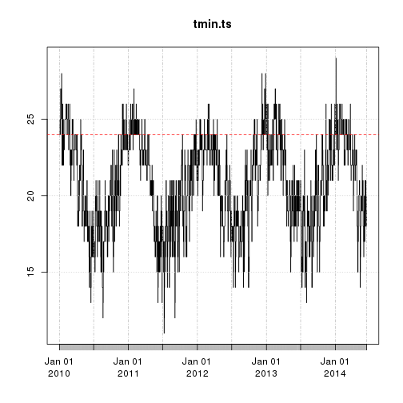

Organiza dados de temperatura do Alerta dengue 
===============================================
Usa dados do OpenWeather, atualmente so' de uma estacao, que e' replicado para
todas as APS


Abre dados: 
-----------


```r
#novoclima <- novosinan <- paste("../",novoclima,sep="")
#d<-read.csv2(novoclima)
galeao<- read.csv2("http://gtsinan.no-ip.biz:8081/alerta/galeao.csv")
d <- galeao
tail(d)
```

```
##         X       data temp.mean temp.sd temp.min temp.max umid.mean umid.sd
## 1627 1627 2014-07-08     22.52    1.39       20       25     73.92    6.23
## 1628 1628 2014-07-09     21.79    2.08       19       26     76.42   11.22
## 1629 1629 2014-07-10     20.73    1.19       19       23     83.58    5.35
## 1630 1630 2014-07-11     19.48    1.37       18       23     83.56    9.00
## 1631 1631 2014-07-12     20.19    1.23       19       22     81.19    7.29
## 1632 1632 2014-07-13     20.88    2.25       18       25     68.58   11.84
##      umid.min umid.max
## 1627       61       83
## 1628       54       94
## 1629       73       88
## 1630       61       94
## 1631       69       88
## 1632       50       88
```


Incluir variavel semana epidemiologica


Acumular por SE e estacao

```
##   estacao     SE temp.mean temp.sd temp.min temp.max umid.mean umid.sd
## 1  galeao 201001     28.65   2.787    25.14    33.43     73.75   12.18
## 2  galeao 201002     29.05   3.253    24.71    34.57     70.36   13.72
## 3  galeao 201003     28.36   3.500    23.86    34.57     71.28   13.68
## 4  galeao 201004     27.72   3.157    24.00    33.43     73.20   12.57
## 5  galeao 201005     30.04   3.836    25.14    36.43     63.73   15.69
## 6  galeao 201006     30.16   3.970    25.00    36.86     61.60   16.47
##   umid.min umid.max
## 1    51.71    89.71
## 2    46.57    90.71
## 3    45.86    88.29
## 4    47.86    88.71
## 5    38.14    85.29
## 6    33.71    84.71
```

 


Salvar:


```r
outputfile
```

```
## [1] "../dados_limpos/temp_201429.csv"
```


```r
write.table(dAP,file="../dados_limpos/climasemanaRJ.csv",sep=",",row.names=FALSE)
```
