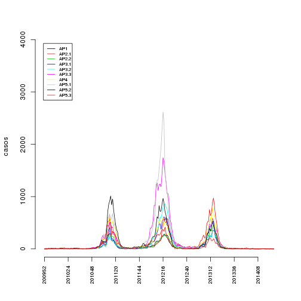

#!/usr/bin/env Rscript

Organização dos dados do SINAN para o Alerta dengue
====================================================
A serie temporal 2010-13 ja esta pronta. Esse script agrega com a serie de 2014


Dados do SINAN 2014
--------------------


```r
novosinan <- paste("../",novosinan,sep="")
```


```
##   DT_NOTIFIC SEM_NOT NU_ANO DT_SIN_PRI SEM_PRI   NM_BAIRRO
## 1 2014-01-15  201403   2014 2014-01-11  201402      TIJUCA
## 2 2014-01-10  201402   2014 2014-01-07  201402       BANGU
## 3 2014-01-09  201402   2014 2014-01-03  201401 SAO CONRADO
## 4 2014-01-16  201403   2014 2014-01-03  201401    ANCHIETA
## 5 2014-01-06  201402   2014 2014-01-04  201401       BANGU
## 6 2014-01-13  201403   2014 2014-01-03  201401 LARANJEIRAS
```


**Criar variavel APS**


Numero de registros sem AP (falha no mapeamento bairro -> APS)

```
## [1] 47
```


**Serie temporal de casos no municipio todo em 2014**


```
##        SE casos
## 28 201428    25
## 29 201429    26
## 30 201430    24
## 31 201431    41
## 32 201432    29
## 33 201433     2
```

**Total de casos no ano**


```
## [1] 1891
```


**Serie temporal de casos na cidade**
 


**Serie temporal de casos por APS**
 

**Salvando**


