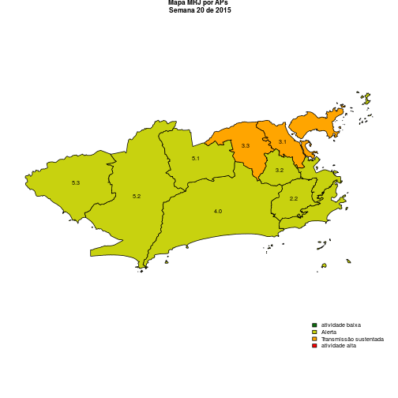
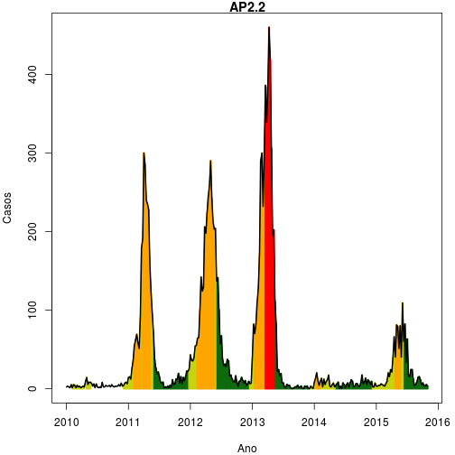
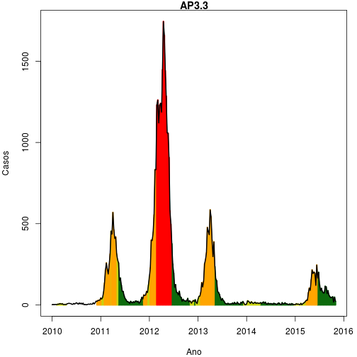
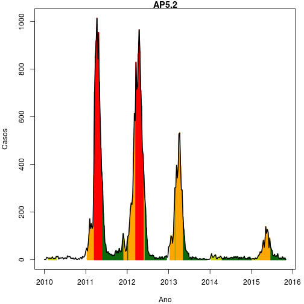
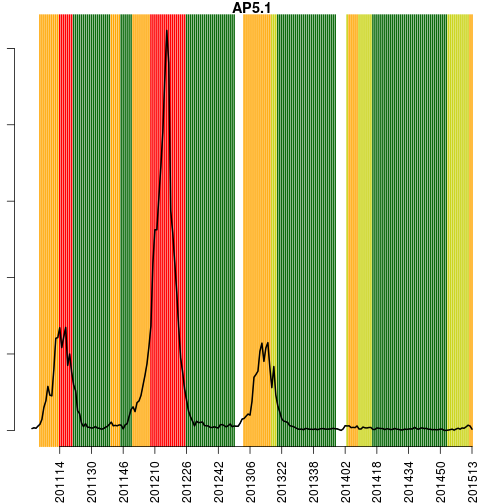
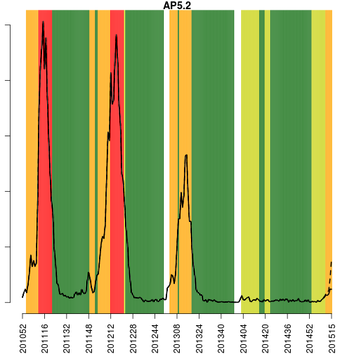

**Rio de Janeiro, 2015-02-02  (SE 201505)**

* [Na cidade](#tab1)

* [Por APS](#tab2)

   

###  Situação na cidade do Rio de Janeiro

 

\pagebreak

Últimas 6 semanas:

-----------------------------------------------------------
 &nbsp;     SE    casos   casos_corrigidos   tweets   tmin 
--------- ------ ------- ------------------ -------- ------
 **260**  201452   11          12.66           40    24.15 

 **261**  201453   17          20.47           39    25.16 

 **262**  201501   29          37.44           37    23.89 

 **263**  201502   32          46.45           51     25.2 

 **264**  201503   12          21.83           62    24.37 

 **265**  201504   NA            NA            48     24.4 
-----------------------------------------------------------

Legenda:

- SE: semana epidemiológica
- casos: nímero de casos de dengue no SINAN
- casos_corrigidos: estimativa do número de casos notificados (ver [Notas](#notas))
- tweets: número de tweets relatando sintomas de dengue (ver [Notas](#notas))
- tmin: média das temperaturas mínimas da semana

   
   

**Alerta por APS**

Código:

*Verde (atividade baixa)*
   temperatura < 22 graus por 3 semanas 
   atividade de tweet normal (não aumentada)
   ausência de transmissão sustentada

*Amarelo (Alerta)*
   temperatura > 22C por mais de 3 semanas
   ou atividade de tweet aumentada

*Laranja (Transmissão sustentada)*
  número reprodutivo >1 por 3 semanas

*Vermelho (atividade alta)*
 incidência > 100:100.000

###  Alerta APS 1

 

   

Histórico da APS 1

-----------------------------------------------------------------------------------
 &nbsp;     SE    temp   casos   inc    AClima   ATweet   ATransm   ACasos   nivel 
--------- ------ ------ ------- ------ -------- -------- --------- -------- -------
 **260**  201452 24.43     0      0       1        0         0        0     amarelo

 **261**  201453 26.14     1    0.4406    1        0         0        0     amarelo

 **262**  201501 24.86     1    0.4406    1        0         0        0     amarelo

 **263**  201502 26.57     0      0       1        0         0        0     amarelo

 **264**  201503 26.14     1    0.4406    1        0         0        0     amarelo

 **265**  201504   26      0      0       1        0         0        0     amarelo
-----------------------------------------------------------------------------------

###  Alerta APS 2.1

 

   

Histórico da AP2.1

-----------------------------------------------------------------------------------
 &nbsp;     SE    temp   casos   inc    AClima   ATweet   ATransm   ACasos   nivel 
--------- ------ ------ ------- ------ -------- -------- --------- -------- -------
 **525**  201452 24.43     0      0       1        0         0        0     amarelo

 **526**  201453 26.14     7    1.267     1        0         0        0     amarelo

 **527**  201501 24.86     2    0.3619    1        0         0        0     amarelo

 **528**  201502 26.57     2    0.3619    1        0         0        0     amarelo

 **529**  201503 26.14     1    0.1809    1        0         0        0     amarelo

 **530**  201504   26    2.527  0.4573    1        0         0        0     amarelo
-----------------------------------------------------------------------------------

###  Alerta APS 2.2

 

   

Histórico da AP2.2

-----------------------------------------------------------------------------------
 &nbsp;     SE    temp   casos   inc    AClima   ATweet   ATransm   ACasos   nivel 
--------- ------ ------ ------- ------ -------- -------- --------- -------- -------
 **790**  201452 24.43     2    0.5389    1        0         0        0     amarelo

 **791**  201453 26.14     1    0.2695    1        0         0        0     amarelo

 **792**  201501 24.86     2    0.5389    1        0         0        0     amarelo

 **793**  201502 26.57     1    0.2695    1        0         0        0     amarelo

 **794**  201503 26.14     2    0.5389    1        0         0        0     amarelo

 **795**  201504   26   0.8604  0.2318    1        0         0        0     amarelo
-----------------------------------------------------------------------------------

###  Alerta APS 3.1

 

   

Histórico da AP3.1

------------------------------------------------------------------------------------
  &nbsp;     SE    temp   casos   inc    AClima   ATweet   ATransm   ACasos   nivel 
---------- ------ ------ ------- ------ -------- -------- --------- -------- -------
 **1055**  201452  24.6     2    0.2718    1        0         0        0     amarelo

 **1056**  201453  25.1     3    0.4077    1        0         0        0     amarelo

 **1057**  201501 23.86     8    1.087     1        0         0        0     amarelo

 **1058**  201502 25.86     9    1.223     1        0         0        0     amarelo

 **1059**  201503 24.86     0      0       1        0         0        0     amarelo

 **1060**  201504 24.29   14.96  2.034     1        0         0        0     amarelo
------------------------------------------------------------------------------------

###  Alerta APS 3.2

 

   

Histórico da AP3.2

------------------------------------------------------------------------------------
  &nbsp;     SE    temp   casos   inc    AClima   ATweet   ATransm   ACasos   nivel 
---------- ------ ------ ------- ------ -------- -------- --------- -------- -------
 **1320**  201452  24.6     2    0.4084    1        0         0        0     amarelo

 **1321**  201453  25.1     2    0.4084    1        0         0        0     amarelo

 **1322**  201501 23.86     3    0.6126    1        0         0        0     amarelo

 **1323**  201502 25.86     6    1.225     1        0         0        0     amarelo

 **1324**  201503 24.86     2    0.4084    1        0         0        0     amarelo

 **1325**  201504 24.29   10.48   2.14     1        0         0        0     amarelo
------------------------------------------------------------------------------------

###  Alerta APS 3.3

 

   

Histórico da AP3.3

------------------------------------------------------------------------------------
  &nbsp;     SE    temp   casos   inc    AClima   ATweet   ATransm   ACasos   nivel 
---------- ------ ------ ------- ------ -------- -------- --------- -------- -------
 **1585**  201452  24.6     2    0.2164    1        0         0        0     amarelo

 **1586**  201453  25.1     1    0.1082    1        0         0        0     amarelo

 **1587**  201501 23.86     6    0.6491    1        0         0        0     amarelo

 **1588**  201502 25.86     3    0.3245    1        0         0        0     amarelo

 **1589**  201503 24.86     2    0.2164    1        0         0        0     amarelo

 **1590**  201504 24.29   3.547  0.3838    1        0         0        0     amarelo
------------------------------------------------------------------------------------

###  Alerta APS 4

 

   

Histórico da AP4

------------------------------------------------------------------------------------
  &nbsp;     SE    temp   casos   inc    AClima   ATweet   ATransm   ACasos   nivel 
---------- ------ ------ ------- ------ -------- -------- --------- -------- -------
 **1850**  201452 25.43     1    0.1192    0        0         0        0      verde 

 **1851**  201453 25.43     1    0.1192    0        0         0        0      verde 

 **1852**  201501   25      1    0.1192    1        0         0        0     amarelo

 **1853**  201502 24.43     7    0.8345    1        0         0        0     amarelo

 **1854**  201503 23.86     3    0.3576    1        0         0        0     amarelo

 **1855**  201504   25    24.3   2.897     1        0         0        0     amarelo
------------------------------------------------------------------------------------

###  Alerta APS 5.1

 

   

Histórico da AP5.1

------------------------------------------------------------------------------------
  &nbsp;     SE    temp   casos   inc    AClima   ATweet   ATransm   ACasos   nivel 
---------- ------ ------ ------- ------ -------- -------- --------- -------- -------
 **2115**  201452   23      0      0       0        0         0        0      verde 

 **2116**  201453 24.14     0      0       0        0         0        0      verde 

 **2117**  201501 22.57     1    0.1525    1        0         0        0     amarelo

 **2118**  201502 23.43     2    0.3049    1        0         0        0     amarelo

 **2119**  201503 22.29     1    0.1525    1        0         0        0     amarelo

 **2120**  201504 22.71   6.497  0.9906    1        0         0        0     amarelo
------------------------------------------------------------------------------------

###  Alerta APS 5.2

 

   

Histórico da AP5.2

------------------------------------------------------------------------------------
  &nbsp;     SE    temp   casos   inc    AClima   ATweet   ATransm   ACasos   nivel 
---------- ------ ------ ------- ------ -------- -------- --------- -------- -------
 **2380**  201452   23      1    0.1503    0        0         0        0      verde 

 **2381**  201453 24.14     1    0.1503    0        0         0        0      verde 

 **2382**  201501 22.57     4    0.6013    1        0         0        0     amarelo

 **2383**  201502 23.43     2    0.3007    1        0         0        0     amarelo

 **2384**  201503 22.29     0      0       1        0         0        0     amarelo

 **2385**  201504 22.71   2.466  0.3707    1        0         0        0     amarelo
------------------------------------------------------------------------------------

###  Alerta APS 5.3

 

   

Histórico da AP5.3

------------------------------------------------------------------------------------
  &nbsp;     SE    temp   casos   inc    AClima   ATweet   ATransm   ACasos   nivel 
---------- ------ ------ ------- ------ -------- -------- --------- -------- -------
 **2645**  201452   23      1    0.2713    0        0         0        0      verde 

 **2646**  201453 24.14     0      0       0        0         0        0      verde 

 **2647**  201501 22.57     1    0.2713    1        0         0        0     amarelo

 **2648**  201502 23.43     0      0       1        0         0        0     amarelo

 **2649**  201503 22.29     0      0       1        0         0        0     amarelo

 **2650**  201504 22.71     0      0       1        0         0        0     amarelo
------------------------------------------------------------------------------------

###  Notas

- Os dados do sinan mais recentes ainda não foram totalmente digitados. Estimamos o número esperado de casos
notificados considerando o tempo ate os casos serem digitados.
- Os dados de tweets são gerados pelo Observatório de Dengue (UFMG). Os tweets são processados para exclusão de informes e outros temas relacionados a dengue
- Algumas vezes, os casos da última semana ainda não estao disponiveis, nesse caso, usa-se uma estimação com base na tendência de variação da serie 

Créditos
------
Esse e um projeto desenvolvido em parceria pela Fiocruz, FGV e Prefeitura do Rio de Janeiro, com apoio da SVS/MS

Mais detalhes, ver: www.dengue.mat.br

