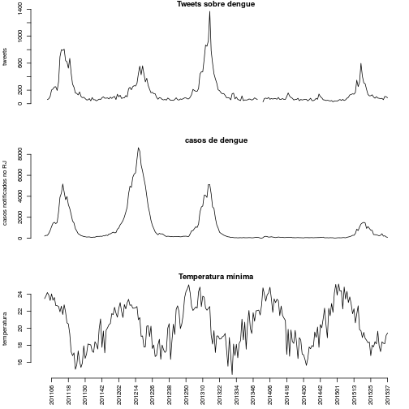
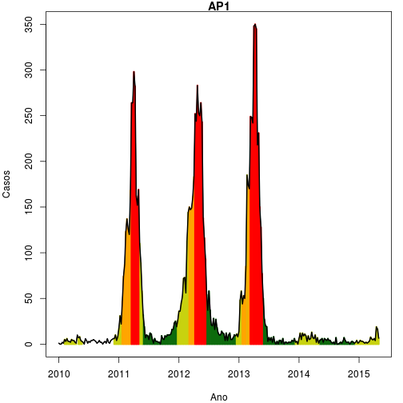
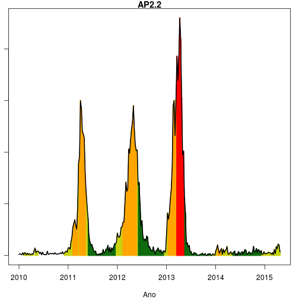
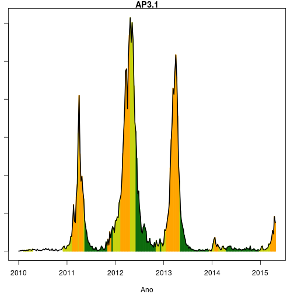
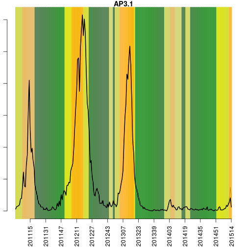
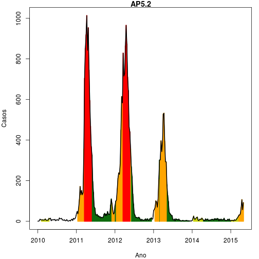

**Rio de Janeiro, 2015-04-27  (SE 201517)**

   
------------
   

Confira a situação da dengue na cidade do Rio de Janeiro. Mais detalhes, ver: [www.dengue.mat.br](www.dengue.mat.br) 

## Índice {#top}
* [Na cidade](#tab1)
* [APS 1](#ap1)
* [APS 2.1](#ap21)
* [APS 2.2](#ap22)
* [APS 3.1](#ap31)
* [APS 3.2](#ap32)
* [APS 3.3](#ap33)
* [APS 4](#ap4)
* [APS 5.1](#ap51)
* [APS 5.2](#ap52)
* [APS 5.3](#ap53)

* [Mapa](#mapa)
* [Notas](#notas)

\newpage

   

###  Situação da dengue na cidade do Rio de Janeiro

 

\newpage

Últimas 6 semanas:

-------------------------------------------------
  SE    casos   casos_corrigidos   tweets   tmin 
------ ------- ------------------ -------- ------
201511   158         181.8          137    22.86 

201512   223         268.5          146    21.71 

201513   214         276.3          141     22.3 

201514   294         426.7          187    20.64 

201515   398         724.1          349    21.69 

201516   145         472.4          208    22.64 
-------------------------------------------------

Legenda:

- SE: semana epidemiológica
- casos: número de casos de dengue no SINAN
- casos_corrigidos: estimativa do número de casos notificados (ver [Notas](#notas))
- tweets: número de tweets relatando sintomas de dengue (ver [Notas](#notas))
- tmin: média das temperaturas mínimas da semana

   
   

**Código de Cores do Alerta por APS**

*Verde (atividade baixa)*
   temperatura < 22 graus por 3 semanas 
   atividade de tweet normal (não aumentada)
   ausência de transmissão sustentada

*Amarelo (Alerta)*
   temperatura > 22C por mais de 3 semanas
   ou atividade de tweet aumentada

*Laranja (Transmissão sustentada)*
  número reprodutivo >1 por 3 semanas

*Vermelho (atividade alta)*
 incidência > 100:100.000

\newpage

### Alerta APS 1 {#ap1}

 

   

Histórico da APS 1

---------------------------------------------------------------------
  SE    temp   casos   inc    Clima   Tweet   Transm   Casos   nivel 
------ ------ ------- ------ ------- ------- -------- ------- -------
201514   22      3    1.322     1       0       0        0    amarelo

201515 22.86     9    3.965     1       0       0        0    amarelo

201516 23.43     2    0.8812    1       1       0        0    amarelo
---------------------------------------------------------------------
[volta](#top)

\newpage

### Alerta APS 2.1 {#ap21}

 

   

Histórico da AP2.1

--------------------------------------------------------------------
  SE    temp   casos   inc   Clima   Tweet   Transm   Casos   nivel 
------ ------ ------- ----- ------- ------- -------- ------- -------
201514   22     26    4.704    1       0       1        0    laranja

201515 22.86    49    8.866    1       0       1        0    laranja

201516 23.43     6    1.086    1       1       0        0    laranja
--------------------------------------------------------------------
[volta](#top)

\newpage

### Alerta APS 2.1 {#ap22}

 

   

Histórico da AP2.2

---------------------------------------------------------------------
  SE    temp   casos   inc    Clima   Tweet   Transm   Casos   nivel 
------ ------ ------- ------ ------- ------- -------- ------- -------
201514   22     15    4.042     1       0       0        0    amarelo

201515 22.86    11    2.964     1       0       0        0    amarelo

201516 23.43     2    0.5389    1       1       0        0    amarelo
---------------------------------------------------------------------
[volta](#top)

\newpage

### Alerta APS 3.1 {#ap31}

 

   

Histórico da AP3.1

--------------------------------------------------------------------
  SE    temp   casos   inc   Clima   Tweet   Transm   Casos   nivel 
------ ------ ------- ----- ------- ------- -------- ------- -------
201514 20.71    31    4.213    0       0       1        0    laranja

201515   22     50    6.795    0       0       1        0    laranja

201516 22.86    23    3.126    0       1       0        0    laranja
--------------------------------------------------------------------
[volta](#top)

### Alerta APS 3.2 {#ap32}

 

   

Histórico da AP3.2

--------------------------------------------------------------------
  SE    temp   casos   inc   Clima   Tweet   Transm   Casos   nivel 
------ ------ ------- ----- ------- ------- -------- ------- -------
201514 20.71    16    3.267    0       0       1        0    laranja

201515   22     16    3.267    0       0       0        0    laranja

201516 22.86    15    3.063    0       1       0        0    laranja
--------------------------------------------------------------------
[volta](#top)

### Alerta APS 3.3 {#ap33}

 

   

Histórico da AP3.3

--------------------------------------------------------------------
  SE    temp   casos   inc   Clima   Tweet   Transm   Casos   nivel 
------ ------ ------- ----- ------- ------- -------- ------- -------
201514 20.71    51    5.517    0       0       0        0    laranja

201515   22     66    7.14     0       0       0        0    laranja

201516 22.86    38    4.111    0       1       1        0    laranja
--------------------------------------------------------------------
[volta](#top)

### Alerta APS 4  {#ap4}

 

   

Histórico da AP4

--------------------------------------------------------------------
  SE    temp   casos   inc   Clima   Tweet   Transm   Casos   nivel 
------ ------ ------- ----- ------- ------- -------- ------- -------
201514 20.43    42    5.007    0       0       1        0    laranja

201515   21     81    9.656    0       0       1        0    laranja

201516 23.71    28    3.338    0       1       1        0    laranja
--------------------------------------------------------------------
[volta](#top)

### Alerta APS 5.1 {#ap51}

 

   

Histórico da AP5.1

--------------------------------------------------------------------
  SE    temp   casos   inc   Clima   Tweet   Transm   Casos   nivel 
------ ------ ------- ----- ------- ------- -------- ------- -------
201514 19.29    55    8.386    0       0       1        0    laranja

201515 20.43    40    6.099    0       0       1        0    laranja

201516 21.29    10    1.525    0       1       0        0    laranja
--------------------------------------------------------------------
[volta](#top)

### Alerta APS 5.2 {#ap52}

 

   

Histórico da AP5.2

--------------------------------------------------------------------
  SE    temp   casos   inc   Clima   Tweet   Transm   Casos   nivel 
------ ------ ------- ----- ------- ------- -------- ------- -------
201514 19.29    48    7.216    0       0       1        0    laranja

201515 20.43    67    10.07    0       0       1        0    laranja

201516 21.29    19    2.856    0       1       0        0    laranja
--------------------------------------------------------------------
[volta](#top)

### Alerta APS 5.3 {#ap53}

 

   

Histórico da AP5.3

---------------------------------------------------------------------
  SE    temp   casos   inc    Clima   Tweet   Transm   Casos   nivel 
------ ------ ------- ------ ------- ------- -------- ------- -------
201514 19.29     7    1.899     0       0       0        0    amarelo

201515 20.43     9    2.442     0       0       0        0    amarelo

201516 21.29     2    0.5427    0       1       0        0    amarelo
---------------------------------------------------------------------
[volta](#top)

   

\newpage

### Mapa APs {#mapa}

   

veja o mapa interativo em [Alerta Dengue](http://alerta.dengue.mat.br)
   

 

[volta](#top)

\newpage

### Notas {#notas}

- Os dados do sinan mais recentes ainda não foram totalmente digitados. Estimamos o número esperado de casos
notificados considerando o tempo ate os casos serem digitados.
- Os dados de tweets são gerados pelo Observatório de Dengue (UFMG). Os tweets são processados para exclusão de informes e outros temas relacionados a dengue
- Algumas vezes, os casos da última semana ainda não estao disponiveis, nesse caso, usa-se uma estimação com base na tendência de variação da serie 

Créditos
------
Esse e um projeto desenvolvido em parceria pela Fiocruz, FGV e Prefeitura do Rio de Janeiro, com apoio da SVS/MS

Mais detalhes do projeto , ver: [www.dengue.mat.br](www.dengue.mat.br) 

   
------------
   

[volta](#top)
