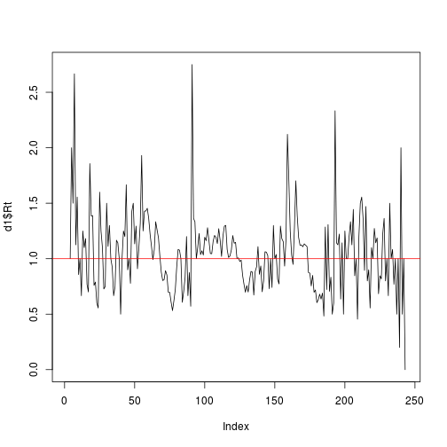

Rt de Nishiura, 2010
===

Dados
========================


```r
d <- read.csv("../GeraAlerta/dados_limpos/dadosAPS_201435.csv")
d1 <- subset(d,APS=="AP1")
plot(d1$casos,type="l")
```

 


Geometric approximation Rt
==========================

$$E[J_{k+1}\vert J_{k}] = R_k J_k$$

 

Estimação de Rt
====================
$J_{k+1}$ ~ $Poisson(J_k R_k)$

onde

$J_{k+1}$ é o número de casos na geração $k+1$

$J_{k}$ é o número de casos na geração $k$

$R_{k}$ é o número reprodutivo na geração $k$

$L = const \Prod_k^{K-1} exp(-R_k J_k)$


```
  [1]  1.000e+00  5.413e-01  1.991e-01  7.326e-02  9.848e-02  5.331e-02
  [7]  6.166e+00  2.891e+01  2.171e+04  1.018e+05  4.773e+05  6.416e+05
 [13]  7.420e+07  1.562e+09  3.290e+10  4.422e+10  2.394e+10  1.141e+17
 [19]  6.420e+20  3.070e+25  6.463e+26  3.031e+27  4.074e+27  1.499e+27
 [25]  1.125e+30  2.370e+31  1.283e+31  6.015e+31  8.086e+31  1.703e+33
 [31]  3.585e+34  4.146e+36  8.730e+37  4.093e+38  2.216e+38  2.979e+38
 [37]  6.272e+39  8.431e+39  1.133e+40  4.169e+39  5.605e+39  2.628e+40
 [43]  1.423e+40  1.068e+43  1.436e+43  7.774e+42  1.637e+44  1.893e+46
 [49]  1.422e+49  1.068e+52  5.087e+58  1.071e+60  5.122e+64  3.069e+79
 [55] 5.681e+113 1.217e+135 8.686e+194 9.915e+302        Inf        Inf
 [61]        Inf        Inf        Inf        Inf        Inf        Inf
 [67]        Inf        Inf        Inf        Inf        Inf        Inf
 [73]        Inf        Inf        Inf        Inf        Inf        Inf
 [79]        Inf        Inf        Inf        Inf        Inf        Inf
 [85]        Inf        Inf        Inf        Inf        Inf        Inf
 [91]        Inf        Inf        Inf        Inf        Inf        Inf
 [97]        Inf        Inf        Inf        Inf        Inf        Inf
[103]        Inf        Inf        Inf        Inf        Inf        Inf
[109]        Inf        Inf        Inf        Inf        Inf        Inf
[115]        Inf        Inf        Inf        Inf        Inf        Inf
[121]        Inf        Inf        Inf        Inf        Inf        Inf
[127]        Inf        Inf        Inf        Inf        Inf        Inf
[133]        Inf        Inf        Inf        Inf        Inf        Inf
[139]        Inf        Inf        Inf        Inf        Inf        Inf
[145]        Inf        Inf        Inf        Inf        Inf        Inf
[151]        Inf        Inf        Inf        Inf        Inf        Inf
[157]        Inf        Inf        Inf        Inf        Inf        Inf
[163]        Inf        Inf        Inf        Inf        Inf        Inf
[169]        Inf        Inf        Inf        Inf        Inf        Inf
[175]        Inf        Inf        Inf        Inf        Inf        Inf
[181]        Inf        Inf        Inf        Inf        Inf        Inf
[187]        Inf        Inf        Inf        Inf        Inf        Inf
[193]        Inf        Inf        Inf        Inf        Inf        Inf
[199]        Inf        Inf         NA         NA         NA         NA
[205]         NA         NA         NA         NA         NA         NA
[211]         NA         NA         NA         NA         NA         NA
[217]         NA         NA         NA         NA         NA         NA
[223]         NA         NA         NA         NA         NA         NA
[229]         NA         NA         NA         NA         NA         NA
[235]         NA         NA         NA         NA         NA         NA
[241]         NA         NA         NA         NA
```


